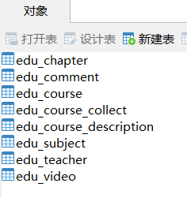
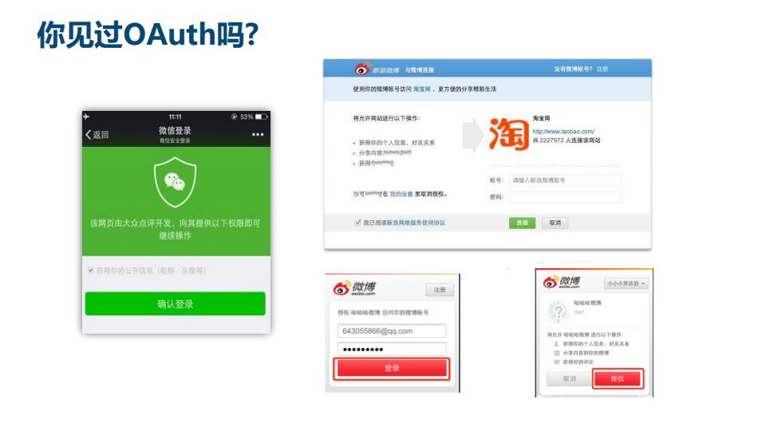
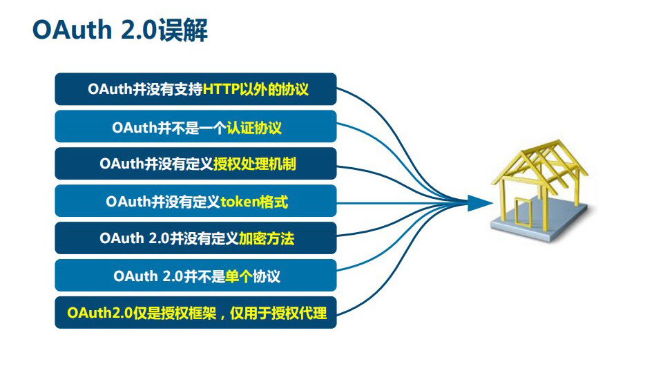

# 谷粒学苑-在线教育项目

# 一、项目介绍

## 01、商业模式介绍

### 01-1、B2C模式

> 两个角色 B：管理员，C：普通用户

管理员：添加 修改 删除

普通用户：查询 

在线教育项目使用的就是B2C模式

核心模块：课程模块

### 01-2、B2B2C模式

例如京东 有普通用户、普通商家、京东自营

普通用户(B)可以购买普通商家(B)和京东自营(C)的商品

## 02、项目功能模块介绍

### 02-1、b2c模式

b2c模式的项目分为两个系统

- 管理员使用的系统(后台管理系统)
  - 讲师管理模块
  - 课程分类管理模块
  - 课程管理模块
  - 统计与分析模块
  - 订单管理模块
  - banner管理模块（首页轮播图管理）
  - 权限管理模块
- 普通用户使用的系统（前台）
  - 首页数据显示
  - 讲师列表和详情
  - 课程列表和课程详情
    - 视频在线播放
  - 登录和注册功能
  - 微信扫码登录
  - 微信扫码支付

## 03、项目技术栈介绍

> 采用前后端分离开发

- 后端
  - SpringBoot
  - SpringCloud
  - MybatisPlus
  - SpringSecurity
  - Redis
  - Maven
  - esayExcel
  - JWT
  - OAuth2
- 前端
  - vue
  - element-ui
  - axios
  - node.js
- 其他技术
  - 阿里云oss存储服务
  - 阿里云视频点播服务
  - 阿里云短信服务
  - 微信支付和登录
  - docker
  - git
  - jenkins

# 二、项目环境搭建

## 01、创建数据库

1. 新建一个`guli_edu`数据库

2. 新建数据表

   ```sql
   # Host: localhost  (Version 5.7.19)
   # Date: 2019-11-18 15:49:32
   # Generator: MySQL-Front 6.1  (Build 1.26)
   
   
   #
   # Structure for table "edu_chapter"
   #
   
   CREATE TABLE `edu_chapter` (
     `id` char(19) NOT NULL COMMENT '章节ID',
     `course_id` char(19) NOT NULL COMMENT '课程ID',
     `title` varchar(50) NOT NULL COMMENT '章节名称',
     `sort` int(10) unsigned NOT NULL DEFAULT '0' COMMENT '显示排序',
     `gmt_create` datetime NOT NULL COMMENT '创建时间',
     `gmt_modified` datetime NOT NULL COMMENT '更新时间',
     PRIMARY KEY (`id`),
     KEY `idx_course_id` (`course_id`)
   ) ENGINE=InnoDB DEFAULT CHARSET=utf8mb4 ROW_FORMAT=COMPACT COMMENT='课程';
   
   #
   # Data for table "edu_chapter"
   #
   
   INSERT INTO `edu_chapter` VALUES ('1','14','第一章：HTML',0,'2019-01-01 12:27:40','2019-01-01 12:55:30'),('1181729226915577857','18','第七章：I/O流',70,'2019-10-09 08:32:58','2019-10-09 08:33:20'),('1192252428399751169','1192252213659774977','第一章节',0,'2019-11-07 09:28:25','2019-11-07 09:28:25'),('15','18','第一章：Java入门',0,'2019-01-01 12:27:40','2019-10-09 09:13:19'),('3','14','第二章：CSS',0,'2019-01-01 12:55:35','2019-01-01 12:27:40'),('32','18','第二章：控制台输入和输出',0,'2019-01-01 12:27:40','2019-01-01 12:27:40'),('44','18','第三章：控制流',0,'2019-01-01 12:27:40','2019-01-01 12:27:40'),('48','18','第四章：类的定义',0,'2019-01-01 12:27:40','2019-01-01 12:27:40'),('63','18','第五章：数组',0,'2019-01-01 12:27:40','2019-01-01 12:27:40'),('64','18','第六章：继承',61,'2019-01-01 12:27:40','2019-10-09 08:32:47');
   
   #
   # Structure for table "edu_comment"
   #
   
   CREATE TABLE `edu_comment` (
     `id` char(19) NOT NULL COMMENT '讲师ID',
     `course_id` varchar(19) NOT NULL DEFAULT '' COMMENT '课程id',
     `teacher_id` char(19) NOT NULL DEFAULT '' COMMENT '讲师id',
     `member_id` varchar(19) NOT NULL DEFAULT '' COMMENT '会员id',
     `nickname` varchar(50) DEFAULT NULL COMMENT '会员昵称',
     `avatar` varchar(255) DEFAULT NULL COMMENT '会员头像',
     `content` varchar(500) DEFAULT NULL COMMENT '评论内容',
     `is_deleted` tinyint(1) unsigned NOT NULL DEFAULT '0' COMMENT '逻辑删除 1（true）已删除， 0（false）未删除',
     `gmt_create` datetime NOT NULL COMMENT '创建时间',
     `gmt_modified` datetime NOT NULL COMMENT '更新时间',
     PRIMARY KEY (`id`),
     KEY `idx_course_id` (`course_id`),
     KEY `idx_teacher_id` (`teacher_id`),
     KEY `idx_member_id` (`member_id`)
   ) ENGINE=InnoDB DEFAULT CHARSET=utf8mb4 COMMENT='评论';
   
   #
   # Data for table "edu_comment"
   #
   
   INSERT INTO `edu_comment` VALUES ('1194499162790211585','1192252213659774977','1189389726308478977','1','小三123','http://thirdwx.qlogo.cn/mmopen/vi_32/DYAIOgq83eoj0hHXhgJNOTSOFsS4uZs8x1ConecaVOB8eIl115xmJZcT4oCicvia7wMEufibKtTLqiaJeanU2Lpg3w/132','课程很好',0,'2019-11-13 14:16:08','2019-11-13 14:16:08'),('1194898406466420738','1192252213659774977','1189389726308478977','1','小三123','http://thirdwx.qlogo.cn/mmopen/vi_32/DYAIOgq83eoj0hHXhgJNOTSOFsS4uZs8x1ConecaVOB8eIl115xmJZcT4oCicvia7wMEufibKtTLqiaJeanU2Lpg3w/132','11',0,'2019-11-14 16:42:35','2019-11-14 16:42:35'),('1194898484388200450','1192252213659774977','1189389726308478977','1','小三123','http://thirdwx.qlogo.cn/mmopen/vi_32/DYAIOgq83eoj0hHXhgJNOTSOFsS4uZs8x1ConecaVOB8eIl115xmJZcT4oCicvia7wMEufibKtTLqiaJeanU2Lpg3w/132','111',0,'2019-11-14 16:42:53','2019-11-14 16:42:53'),('1195251020861317122','1192252213659774977','1189389726308478977','1',NULL,NULL,'2233',0,'2019-11-15 16:03:45','2019-11-15 16:03:45'),('1195251382720700418','1192252213659774977','1189389726308478977','1',NULL,NULL,'4455',0,'2019-11-15 16:05:11','2019-11-15 16:05:11'),('1195252819177570306','1192252213659774977','1189389726308478977','1','小三1231','http://thirdwx.qlogo.cn/mmopen/vi_32/DYAIOgq83eoj0hHXhgJNOTSOFsS4uZs8x1ConecaVOB8eIl115xmJZcT4oCicvia7wMEufibKtTLqiaJeanU2Lpg3w/132','55',0,'2019-11-15 16:10:53','2019-11-15 16:10:53'),('1195252899448160258','1192252213659774977','1189389726308478977','1','小三1231','http://thirdwx.qlogo.cn/mmopen/vi_32/DYAIOgq83eoj0hHXhgJNOTSOFsS4uZs8x1ConecaVOB8eIl115xmJZcT4oCicvia7wMEufibKtTLqiaJeanU2Lpg3w/132','55',0,'2019-11-15 16:11:13','2019-11-15 16:11:13'),('1195252920587452417','1192252213659774977','1189389726308478977','1','小三1231','http://thirdwx.qlogo.cn/mmopen/vi_32/DYAIOgq83eoj0hHXhgJNOTSOFsS4uZs8x1ConecaVOB8eIl115xmJZcT4oCicvia7wMEufibKtTLqiaJeanU2Lpg3w/132','223344',0,'2019-11-15 16:11:18','2019-11-15 16:11:18'),('1195262128095559681','14','1189389726308478977','1','小三1231','http://thirdwx.qlogo.cn/mmopen/vi_32/DYAIOgq83eoj0hHXhgJNOTSOFsS4uZs8x1ConecaVOB8eIl115xmJZcT4oCicvia7wMEufibKtTLqiaJeanU2Lpg3w/132','11',0,'2019-11-15 16:47:53','2019-11-15 16:47:53'),('1196264505170767874','1192252213659774977','1189389726308478977','1','小三1231','http://thirdwx.qlogo.cn/mmopen/vi_32/DYAIOgq83eoj0hHXhgJNOTSOFsS4uZs8x1ConecaVOB8eIl115xmJZcT4oCicvia7wMEufibKtTLqiaJeanU2Lpg3w/132','666666',0,'2019-11-18 11:10:58','2019-11-18 11:10:58');
   
   #
   # Structure for table "edu_course"
   #
   
   CREATE TABLE `edu_course` (
     `id` char(19) NOT NULL COMMENT '课程ID',
     `teacher_id` char(19) NOT NULL COMMENT '课程讲师ID',
     `subject_id` char(19) NOT NULL COMMENT '课程专业ID',
     `subject_parent_id` char(19) NOT NULL COMMENT '课程专业父级ID',
     `title` varchar(50) NOT NULL COMMENT '课程标题',
     `price` decimal(10,2) unsigned NOT NULL DEFAULT '0.00' COMMENT '课程销售价格，设置为0则可免费观看',
     `lesson_num` int(10) unsigned NOT NULL DEFAULT '0' COMMENT '总课时',
     `cover` varchar(255) CHARACTER SET utf8 NOT NULL COMMENT '课程封面图片路径',
     `buy_count` bigint(10) unsigned NOT NULL DEFAULT '0' COMMENT '销售数量',
     `view_count` bigint(10) unsigned NOT NULL DEFAULT '0' COMMENT '浏览数量',
     `version` bigint(20) unsigned NOT NULL DEFAULT '1' COMMENT '乐观锁',
     `status` varchar(10) NOT NULL DEFAULT 'Draft' COMMENT '课程状态 Draft未发布  Normal已发布',
     `is_deleted` tinyint(3) DEFAULT NULL COMMENT '逻辑删除 1（true）已删除， 0（false）未删除',
     `gmt_create` datetime NOT NULL COMMENT '创建时间',
     `gmt_modified` datetime NOT NULL COMMENT '更新时间',
     PRIMARY KEY (`id`),
     KEY `idx_title` (`title`),
     KEY `idx_subject_id` (`subject_id`),
     KEY `idx_teacher_id` (`teacher_id`)
   ) ENGINE=InnoDB DEFAULT CHARSET=utf8mb4 ROW_FORMAT=COMPACT COMMENT='课程';
   
   #
   # Data for table "edu_course"
   #
   
   INSERT INTO `edu_course` VALUES ('1192252213659774977','1189389726308478977','1178214681139539969','1178214681118568449','java基础课程：test',0.01,2,'https://guli-file-190513.oss-cn-beijing.aliyuncs.com/cover/default.gif',4,387,1,'Normal',0,'2019-11-07 09:27:33','2019-11-18 13:35:03'),('14','1189389726308478977','1101348944971091969','1101348944920760321','XHTML CSS2 JS整站制作教程课程学习',0.00,3,'http://guli-file.oss-cn-beijing.aliyuncs.com/cover/2019/03/13/d0086eb0-f2dc-45f7-bba1-744d95e5be0f.jpg',3,44,15,'Normal',0,'2018-04-02 18:33:34','2019-11-16 21:21:45'),('15','1189389726308478977','1101348944971091969','1101348944920760321','HTML5入门课程学习',0.00,23,'http://guli-file.oss-cn-beijing.aliyuncs.com/cover/2019/03/13/22997b8e-3606-4d2e-9b4f-09f48418b6e4.jpg',0,51,17,'Normal',0,'2018-04-02 18:34:32','2019-11-12 10:19:20'),('18','1189389726308478977','1178214681139539969','1178214681118568449','Java精品课程',0.01,20,'http://guli-file.oss-cn-beijing.aliyuncs.com/cover/2019/03/06/866e9aca-b530-4f71-a690-72d4a4bfd1e7.jpg',151,737,6,'Normal',0,'2018-04-02 21:28:46','2019-11-18 11:14:52');
   
   #
   # Structure for table "edu_course_collect"
   #
   
   CREATE TABLE `edu_course_collect` (
     `id` char(19) NOT NULL COMMENT '收藏ID',
     `course_id` char(19) NOT NULL COMMENT '课程讲师ID',
     `member_id` char(19) NOT NULL DEFAULT '' COMMENT '课程专业ID',
     `is_deleted` tinyint(3) NOT NULL DEFAULT '0' COMMENT '逻辑删除 1（true）已删除， 0（false）未删除',
     `gmt_create` datetime NOT NULL COMMENT '创建时间',
     `gmt_modified` datetime NOT NULL COMMENT '更新时间',
     PRIMARY KEY (`id`)
   ) ENGINE=InnoDB DEFAULT CHARSET=utf8mb4 ROW_FORMAT=COMPACT COMMENT='课程收藏';
   
   #
   # Data for table "edu_course_collect"
   #
   
   INSERT INTO `edu_course_collect` VALUES ('1196269345666019330','1192252213659774977','1',1,'2019-11-18 11:30:12','2019-11-18 11:30:12');
   
   #
   # Structure for table "edu_course_description"
   #
   
   CREATE TABLE `edu_course_description` (
     `id` char(19) NOT NULL COMMENT '课程ID',
     `description` text COMMENT '课程简介',
     `gmt_create` datetime NOT NULL COMMENT '创建时间',
     `gmt_modified` datetime NOT NULL COMMENT '更新时间',
     PRIMARY KEY (`id`)
   ) ENGINE=InnoDB DEFAULT CHARSET=utf8mb4 COMMENT='课程简介';
   
   #
   # Data for table "edu_course_description"
   #
   
   INSERT INTO `edu_course_description` VALUES ('1104870479077879809','<p>11</p>','2019-03-11 06:23:44','2019-03-11 06:23:44'),('1192252213659774977','<p>测试</p>','2019-11-07 09:27:33','2019-11-13 16:21:28'),('14','','2019-03-13 06:04:43','2019-03-13 06:05:33'),('15','','2019-03-13 06:03:33','2019-03-13 06:04:22'),('18','<p>本套Java视频完全针对零基础学员，课堂实录，自发布以来，好评如潮！Java视频中注重与学生互动，讲授幽默诙谐、细致入微，覆盖Java基础所有核心知识点，同类Java视频中也是代码量大、案例多、实战性强的。同时，本Java视频教程注重技术原理剖析，深入JDK源码，辅以代码实战贯穿始终，用实践驱动理论，并辅以必要的代码练习。</p>\n<p>------------------------------------</p>\n<p>视频特点：</p>\n<p>通过学习本Java视频教程，大家能够真正将Java基础知识学以致用、活学活用，构架Java编程思想，牢牢掌握\"源码级\"的Javase核心技术，并为后续JavaWeb等技术的学习奠定扎实基础。<br /><br />1.通俗易懂，细致入微：每个知识点高屋建瓴，深入浅出，简洁明了的说明问题<br />2.具实战性：全程真正代码实战，涵盖上百个企业应用案例及练习<br />3.深入：源码分析，更有 Java 反射、动态代理的实际应用等<br />4.登录尚硅谷官网，技术讲师免费在线答疑</p>','2019-03-06 18:06:36','2019-10-30 19:58:36');
   
   #
   # Structure for table "edu_subject"
   #
   
   CREATE TABLE `edu_subject` (
     `id` char(19) NOT NULL COMMENT '课程类别ID',
     `title` varchar(10) NOT NULL COMMENT '类别名称',
     `parent_id` char(19) NOT NULL DEFAULT '0' COMMENT '父ID',
     `sort` int(10) unsigned NOT NULL DEFAULT '0' COMMENT '排序字段',
     `gmt_create` datetime NOT NULL COMMENT '创建时间',
     `gmt_modified` datetime NOT NULL COMMENT '更新时间',
     PRIMARY KEY (`id`),
     KEY `idx_parent_id` (`parent_id`)
   ) ENGINE=InnoDB DEFAULT CHARSET=utf8mb4 ROW_FORMAT=COMPACT COMMENT='课程科目';
   
   #
   # Data for table "edu_subject"
   #
   
   INSERT INTO `edu_subject` VALUES ('1178214681118568449','后端开发','0',1,'2019-09-29 15:47:25','2019-09-29 15:47:25'),('1178214681139539969','Java','1178214681118568449',1,'2019-09-29 15:47:25','2019-09-29 15:47:25'),('1178214681181483010','前端开发','0',3,'2019-09-29 15:47:25','2019-09-29 15:47:25'),('1178214681210843137','JavaScript','1178214681181483010',4,'2019-09-29 15:47:25','2019-09-29 15:47:25'),('1178214681231814658','云计算','0',5,'2019-09-29 15:47:25','2019-09-29 15:47:25'),('1178214681252786178','Docker','1178214681231814658',5,'2019-09-29 15:47:25','2019-09-29 15:47:25'),('1178214681294729217','Linux','1178214681231814658',6,'2019-09-29 15:47:25','2019-09-29 15:47:25'),('1178214681324089345','系统/运维','0',7,'2019-09-29 15:47:25','2019-09-29 15:47:25'),('1178214681353449473','Linux','1178214681324089345',7,'2019-09-29 15:47:25','2019-09-29 15:47:25'),('1178214681382809602','Windows','1178214681324089345',8,'2019-09-29 15:47:25','2019-09-29 15:47:25'),('1178214681399586817','数据库','0',9,'2019-09-29 15:47:25','2019-09-29 15:47:25'),('1178214681428946945','MySQL','1178214681399586817',9,'2019-09-29 15:47:25','2019-09-29 15:47:25'),('1178214681454112770','MongoDB','1178214681399586817',10,'2019-09-29 15:47:25','2019-09-29 15:47:25'),('1178214681483472898','大数据','0',11,'2019-09-29 15:47:25','2019-09-29 15:47:25'),('1178214681504444418','Hadoop','1178214681483472898',11,'2019-09-29 15:47:25','2019-09-29 15:47:25'),('1178214681529610242','Spark','1178214681483472898',12,'2019-09-29 15:47:25','2019-09-29 15:47:25'),('1178214681554776066','人工智能','0',13,'2019-09-29 15:47:25','2019-09-29 15:47:25'),('1178214681584136193','Python','1178214681554776066',13,'2019-09-29 15:47:25','2019-09-29 15:47:25'),('1178214681613496321','编程语言','0',14,'2019-09-29 15:47:25','2019-09-29 15:47:25'),('1178214681626079234','Java','1178214681613496321',14,'2019-09-29 15:47:25','2019-09-29 15:47:25'),('1178585108407984130','Python','1178214681118568449',2,'2019-09-30 16:19:22','2019-09-30 16:19:22'),('1178585108454121473','HTML/CSS','1178214681181483010',3,'2019-09-30 16:19:22','2019-09-30 16:19:22');
   
   #
   # Structure for table "edu_teacher"
   #
   
   CREATE TABLE `edu_teacher` (
     `id` char(19) NOT NULL COMMENT '讲师ID',
     `name` varchar(20) NOT NULL COMMENT '讲师姓名',
     `intro` varchar(500) NOT NULL DEFAULT '' COMMENT '讲师简介',
     `career` varchar(500) DEFAULT NULL COMMENT '讲师资历,一句话说明讲师',
     `level` int(10) unsigned NOT NULL COMMENT '头衔 1高级讲师 2首席讲师',
     `avatar` varchar(255) DEFAULT NULL COMMENT '讲师头像',
     `sort` int(10) unsigned NOT NULL DEFAULT '0' COMMENT '排序',
     `is_deleted` tinyint(1) unsigned NOT NULL DEFAULT '0' COMMENT '逻辑删除 1（true）已删除， 0（false）未删除',
     `gmt_create` datetime NOT NULL COMMENT '创建时间',
     `gmt_modified` datetime NOT NULL COMMENT '更新时间',
     PRIMARY KEY (`id`),
     UNIQUE KEY `uk_name` (`name`)
   ) ENGINE=InnoDB DEFAULT CHARSET=utf8mb4 COMMENT='讲师';
   
   #
   # Data for table "edu_teacher"
   #
   
   INSERT INTO `edu_teacher` VALUES ('1','张三','近年主持国家自然科学基金（6项）、江苏省重大科技成果转化项目（5项）、江苏省产学研前瞻性联合研究项目（3项）、省工业科技支撑、省高技术、省自然科学基金等省部级及其企业的主要科研项目40多个，多个项目在企业成功转化，产生了较好的经济、社会和环境效益。积极开展产学研科技合作，并与省内16家企业建立了江苏省研究生工作站，其中6家为江苏省优秀研究生工作站','高级',1,'https://guli-file-190513.oss-cn-beijing.aliyuncs.com/avatar/default.jpg',0,0,'2019-10-30 14:18:46','2019-11-12 13:36:36'),('1189389726308478977','晴天','高级讲师简介','高级讲师资历',2,'https://online-teach-file.oss-cn-beijing.aliyuncs.com/teacher/2019/10/30/de47ee9b-7fec-43c5-8173-13c5f7f689b2.png',1,0,'2019-10-30 11:53:03','2019-10-30 11:53:03'),('1189390295668469762','李刚','高级讲师简介','高级讲师',2,'https://online-teach-file.oss-cn-beijing.aliyuncs.com/teacher/2019/10/30/b8aa36a2-db50-4eca-a6e3-cc6e608355e0.png',2,0,'2019-10-30 11:55:19','2019-11-12 13:37:52'),('1189426437876985857','王二','高级讲师简介','高级讲师',1,'https://online-teach-file.oss-cn-beijing.aliyuncs.com/teacher/2019/11/08/e44a2e92-2421-4ea3-bb49-46f2ec96ef88.png',0,0,'2019-10-30 14:18:56','2019-11-12 13:37:35'),('1189426464967995393','王五','高级讲师简介','高级讲师',1,'https://online-teach-file.oss-cn-beijing.aliyuncs.com/teacher/2019/10/30/65423f14-49a9-4092-baf5-6d0ef9686a85.png',0,0,'2019-10-30 14:19:02','2019-11-12 13:37:18'),('1192249914833055746','李四','高级讲师简介','高级讲师',1,'https://online-teach-file.oss-cn-beijing.aliyuncs.com/teacher/2019/11/07/91871e25-fd83-4af6-845f-ea8d471d825d.png',0,0,'2019-11-07 09:18:25','2019-11-12 13:37:01'),('1192327476087115778','1222-12-12','1111','11',1,'https://online-teach-file.oss-cn-beijing.aliyuncs.com/teacher/2019/11/08/5805c6cd-c8ad-4a77-aafd-d2e083bfd8a4.png',0,1,'2019-11-07 14:26:37','2019-11-11 16:26:26'),('1195337453429129218','test','sdfsdf','sdfdf',1,'https://guli-file-190513.oss-cn-beijing.aliyuncs.com/avatar/default.jpg',0,1,'2019-11-15 21:47:12','2019-11-15 21:47:27');
   
   #
   # Structure for table "edu_video"
   #
   
   CREATE TABLE `edu_video` (
     `id` char(19) NOT NULL COMMENT '视频ID',
     `course_id` char(19) NOT NULL COMMENT '课程ID',
     `chapter_id` char(19) NOT NULL COMMENT '章节ID',
     `title` varchar(50) NOT NULL COMMENT '节点名称',
     `video_source_id` varchar(100) DEFAULT NULL COMMENT '云端视频资源',
     `video_original_name` varchar(100) DEFAULT NULL COMMENT '原始文件名称',
     `sort` int(10) unsigned NOT NULL DEFAULT '0' COMMENT '排序字段',
     `play_count` bigint(20) unsigned NOT NULL DEFAULT '0' COMMENT '播放次数',
     `is_free` tinyint(1) unsigned NOT NULL DEFAULT '0' COMMENT '是否可以试听：0收费 1免费',
     `duration` float NOT NULL DEFAULT '0' COMMENT '视频时长（秒）',
     `status` varchar(20) NOT NULL DEFAULT 'Empty' COMMENT 'Empty未上传 Transcoding转码中  Normal正常',
     `size` bigint(20) unsigned NOT NULL DEFAULT '0' COMMENT '视频源文件大小（字节）',
     `version` bigint(20) unsigned NOT NULL DEFAULT '1' COMMENT '乐观锁',
     `gmt_create` datetime NOT NULL COMMENT '创建时间',
     `gmt_modified` datetime NOT NULL COMMENT '更新时间',
     PRIMARY KEY (`id`),
     KEY `idx_course_id` (`course_id`),
     KEY `idx_chapter_id` (`chapter_id`)
   ) ENGINE=InnoDB DEFAULT CHARSET=utf8mb4 ROW_FORMAT=COMPACT COMMENT='课程视频';
   
   #
   # Data for table "edu_video"
   #
   
   INSERT INTO `edu_video` VALUES ('1182499307429339137','18','32','第一节','','',0,0,0,0,'',0,1,'2019-10-11 11:32:59','2019-10-11 11:57:38'),('1185312444399071234','14','1','12','','',0,0,0,0,'Empty',0,1,'2019-10-19 05:51:23','2019-10-19 05:51:33'),('1189434737808990210','18','44','测试','','',1,0,0,0,'Empty',0,1,'2019-10-30 14:51:55','2019-10-30 14:51:55'),('1189471423678939138','18','1181729226915577857','test','2b887dc9584d4dc68908780ec57cd3b9','视频',1,0,0,0,'Empty',0,1,'2019-10-30 17:17:41','2019-10-30 17:17:41'),('1189476403626409986','18','1181729226915577857','22','5155c73dc112475cbbddccf4723f7cef','视频.mp4',0,0,0,0,'Empty',0,1,'2019-10-30 17:37:29','2019-10-30 17:37:29'),('1192252824606289921','1192252213659774977','1192252428399751169','第一课时','756cf06db9cb4f30be85a9758b19c645','eae2b847ef8503b81f5d5593d769dde2.mp4',0,0,0,0,'Empty',0,1,'2019-11-07 09:29:59','2019-11-07 09:29:59'),('1192628092797730818','1192252213659774977','1192252428399751169','第二课时','2a02d726622f4c7089d44cb993c531e1','eae2b847ef8503b81f5d5593d769dde2.mp4',0,0,1,0,'Empty',0,1,'2019-11-08 10:21:10','2019-11-08 10:21:22'),('1192632495013380097','1192252213659774977','1192252428399751169','第三课时','4e560c892fdf4fa2b42e0671aa42fa9d','eae2b847ef8503b81f5d5593d769dde2.mp4',0,0,1,0,'Empty',0,1,'2019-11-08 10:38:40','2019-11-08 10:38:40'),('1194117638832111617','1192252213659774977','1192252428399751169','第四课时','4e560c892fdf4fa2b42e0671aa42fa9d','eae2b847ef8503b81f5d5593d769dde2.mp4',0,0,0,0,'Empty',0,1,'2019-11-12 13:00:05','2019-11-12 13:00:05'),('1196263770832023554','1192252213659774977','1192252428399751169','第五课时','27d21158b0834cb5a8d50710937de330','eae2b847ef8503b81f5d5593d769dde2.mp4',5,0,0,0,'Empty',0,1,'2019-11-18 11:08:03','2019-11-18 11:08:03'),('17','18','15','第一节：Java简介','196116a6fee742e1ba9f6c18f65bd8c1','1',1,1000,1,100,'Draft',0,1,'2019-01-01 13:08:57','2019-10-11 11:26:39'),('18','18','15','第二节：表达式和赋值语句','2d99b08ca0214909899910c9ba042d47','7 - How Do I Find Time for My ',2,999,1,100,'Draft',0,1,'2019-01-01 13:09:02','2019-03-08 03:30:27'),('19','18','15','第三节：String类','51120d59ddfd424cb5ab08b44fc8b23a','eae2b847ef8503b81f5d5593d769dde2.mp4',3,888,0,100,'Draft',0,1,'2019-01-01 13:09:05','2019-11-12 12:50:45'),('20','18','15','第四节：程序风格','2a38988892d84df598752226c50f3fa3','00-day10总结.avi',4,666,0,100,'Draft',0,1,'2019-01-01 13:09:05','2019-10-11 09:20:09');
   ```

   

## 02、数据库设计规范

以下规约只针对本模块，更全面的文档参考《阿里巴巴Java开发手册》：五、MySQL数据库

1. 库名与应用名称尽量一致

2. 表名、字段名必须使用小写字母或数字，禁止出现数字开头，

3. 表名不使用复数名词

4. 表的命名最好是加上“业务名称_表的作用”。如，edu_teacher

5. 表必备三字段：id, gmt_create, gmt_modified

   说明：

   其中 id 必为主键，类型为 bigint unsigned、单表时自增、步长为 1。

   （如果使用分库分表集群部署，则id类型为verchar，非自增，业务中使用分布式id生成器）

   gmt_create, gmt_modified 的类型均为 datetime 类型，前者现在时表示主动创建，后者过去分词表示被 动更新。

6. 单表行数超过 500 万行或者单表容量超过 2GB，才推荐进行分库分表。 说明：如果预计三年后的数据量根本达不到这个级别，请不要在创建表时就分库分表。 

7. 表达是与否概念的字段，必须使用 is_xxx 的方式命名，数据类型是 unsigned tinyint （1 表示是，0 表示否）。 

   说明：任何字段如果为非负数，必须是 unsigned。 

   注意：POJO 类中的任何布尔类型的变量，都不要加 is 前缀。数据库表示是与否的值，使用 tinyint 类型，坚持 is_xxx 的 命名方式是为了明确其取值含义与取值范围。 

   正例：表达逻辑删除的字段名 is_deleted，1 表示删除，0 表示未删除。 

8. 小数类型为 decimal，禁止使用 float 和 double。 说明：float 和 double 在存储的时候，存在精度损失的问题，很可能在值的比较时，得到不 正确的结果。如果存储的数据范围超过 decimal 的范围，建议将数据拆成整数和小数分开存储。

9. 如果存储的字符串长度几乎相等，使用 char 定长字符串类型。 

10. varchar 是可变长字符串，不预先分配存储空间，长度不要超过 5000，如果存储长度大于此值，定义字段类型为 text，独立出来一张表，用主键来对应，避免影响其它字段索 引效率。

11. 唯一索引名为 uk_字段名；普通索引名则为 idx_字段名。

    说明：uk_ 即 unique key；idx_ 即 index 的简称

12. 不得使用外键与级联，一切外键概念必须在应用层解决。外键与级联更新适用于单机低并发，不适合分布式、高并发集群；级联更新是强阻塞，存在数据库更新风暴的风险；外键影响数据库的插入速度。 

## 03、项目结构


**guli-parent：在线教学根目录（父工程），管理四个子模块：**

- canal-client：canal数据库表同步模块（统计同步数据）

- common：公共模块父节点

  - common-util：工具类模块，所有模块都可以依赖于它
  - service-base：service服务的base包，包含service服务的公共配置类，所有service模块依赖于它
  - spring-security：认证与授权模块，需要认证授权的service服务依赖于它

- infrastructure：基础服务模块父节点

  api-gateway：api网关服务

- service：api接口服务父节点

  - service-acl：用户权限管理api接口服务（用户管理、角色管理和权限管理等）
  - service-cms：cms api接口服务
  - service-edu：教学相关api接口服务
  - service-msm：短信api接口服务
  - service-order：订单相关api接口服务
  - service-oss：阿里云oss api接口服务
  - service-statistics：统计报表api接口服务
  - service-ucenter：会员api接口服务
  - service-vod：视频点播api接口服务

## 04、搭建项目

### 04-1、pom父工程配置

1. pom.xml改为父工程

   ```xml
   <packaging>pom</packaging>
   ```

   

2. 删除src文件夹和删除父工程配置

   ```xml
   <parent>
       <groupId>org.springframework.boot</groupId>
       <artifactId>spring-boot-starter-parent</artifactId>
       <version>2.2.1.RELEASE</version>
       <relativePath/> <!-- lookup parent from repository -->
   </parent>
   ```

3. 添加统一管理jar包依赖版本

   ```xml
   <properties>
       <java.version>1.8</java.version>
       <guli.version>0.0.1-SNAPSHOT</guli.version>
       <mybatis-plus.version>3.0.5</mybatis-plus.version>
       <velocity.version>2.0</velocity.version>
       <swagger.version>3.0.0</swagger.version>
       <aliyun.oss.version>2.8.3</aliyun.oss.version>
       <jodatime.version>2.10.1</jodatime.version>
       <poi.version>3.17</poi.version>
       <commons-fileupload.version>1.3.1</commons-fileupload.version>
       <commons-io.version>2.6</commons-io.version>
       <httpclient.version>4.5.1</httpclient.version>
       <jwt.version>0.7.0</jwt.version>
       <aliyun-java-sdk-core.version>4.3.3</aliyun-java-sdk-core.version>
       <aliyun-sdk-oss.version>3.1.0</aliyun-sdk-oss.version>
       <aliyun-java-sdk-vod.version>2.15.2</aliyun-java-sdk-vod.version>
       <aliyun-java-vod-upload.version>1.4.11</aliyun-java-vod-upload.version>
       <aliyun-sdk-vod-upload.version>1.4.11</aliyun-sdk-vod-upload.version>
       <fastjson.version>1.2.28</fastjson.version>
       <gson.version>2.8.2</gson.version>
       <json.version>20170516</json.version>
       <commons-dbutils.version>1.7</commons-dbutils.version>
       <canal.client.version>1.1.0</canal.client.version>
       <docker.image.prefix>zx</docker.image.prefix>
       <cloud-alibaba.version>0.2.2.RELEASE</cloud-alibaba.version>
   </properties>
   ```

4. 配置子类锁定依赖的版本和不用写groupId和version

5. 整个pom.xml

   ```xml
   <?xml version="1.0" encoding="UTF-8"?>
   <project xmlns="http://maven.apache.org/POM/4.0.0" xmlns:xsi="http://www.w3.org/2001/XMLSchema-instance"
            xsi:schemaLocation="http://maven.apache.org/POM/4.0.0 https://maven.apache.org/xsd/maven-4.0.0.xsd">
       <modelVersion>4.0.0</modelVersion>
   
       <groupId>com.geek</groupId>
       <artifactId>guli_edu</artifactId>
       <version>0.0.1-SNAPSHOT</version>
       <packaging>pom</packaging>
   
       <properties>
           <java.version>1.8</java.version>
           <guli.version>0.0.1-SNAPSHOT</guli.version>
           <mybatis-plus.version>3.0.5</mybatis-plus.version>
           <velocity.version>2.0</velocity.version>
           <swagger.version>3.0.0</swagger.version>
           <aliyun.oss.version>2.8.3</aliyun.oss.version>
           <jodatime.version>2.10.1</jodatime.version>
           <poi.version>3.17</poi.version>
           <commons-fileupload.version>1.3.1</commons-fileupload.version>
           <commons-io.version>2.6</commons-io.version>
           <httpclient.version>4.5.1</httpclient.version>
           <jwt.version>0.7.0</jwt.version>
           <aliyun-java-sdk-core.version>4.3.3</aliyun-java-sdk-core.version>
           <aliyun-sdk-oss.version>3.1.0</aliyun-sdk-oss.version>
           <aliyun-java-sdk-vod.version>2.15.2</aliyun-java-sdk-vod.version>
           <aliyun-java-vod-upload.version>1.4.11</aliyun-java-vod-upload.version>
           <aliyun-sdk-vod-upload.version>1.4.11</aliyun-sdk-vod-upload.version>
           <fastjson.version>1.2.28</fastjson.version>
           <gson.version>2.8.2</gson.version>
           <json.version>20170516</json.version>
           <commons-dbutils.version>1.7</commons-dbutils.version>
           <canal.client.version>1.1.0</canal.client.version>
           <docker.image.prefix>zx</docker.image.prefix>
           <cloud-alibaba.version>0.2.2.RELEASE</cloud-alibaba.version>
       </properties>
       <dependencyManagement>
           <dependencies>
               <!--Spring Cloud-->
               <dependency>
                   <groupId>org.springframework.cloud</groupId>
                   <artifactId>spring-cloud-dependencies</artifactId>
                   <version>Hoxton.RELEASE</version>
                   <type>pom</type>
                   <scope>import</scope>
               </dependency>
               <dependency>
                   <groupId>org.springframework.cloud</groupId>
                   <artifactId>spring-cloud-alibaba-dependencies</artifactId>
                   <version>${cloud-alibaba.version}</version>
                   <type>pom</type>
                   <scope>import</scope>
               </dependency>
               <!--mybatis-plus 持久层-->
               <dependency>
                   <groupId>com.baomidou</groupId>
                   <artifactId>mybatis-plus-boot-starter</artifactId>
                   <version>${mybatis-plus.version}</version>
               </dependency>
               <!-- velocity 模板引擎, Mybatis Plus 代码生成器需要 -->
               <dependency>
                   <groupId>org.apache.velocity</groupId>
                   <artifactId>velocity-engine-core</artifactId>
                   <version>${velocity.version}</version>
               </dependency>
               <!--swagger-->
               <dependency>
                   <groupId>io.springfox</groupId>
                   <artifactId>springfox-boot-starter</artifactId>
                   <version>${swagger.version}</version>
               </dependency>
               <!--swagger ui-->
               <dependency>
                   <groupId>io.springfox</groupId>
                   <artifactId>springfox-swagger-ui</artifactId>
                   <version>${swagger.version}</version>
               </dependency>
               <!--aliyunOSS-->
               <dependency>
                   <groupId>com.aliyun.oss</groupId>
                   <artifactId>aliyun-sdk-oss</artifactId>
                   <version>${aliyun.oss.version}</version>
               </dependency>
               <!--日期时间工具-->
               <dependency>
                   <groupId>joda-time</groupId>
                   <artifactId>joda-time</artifactId>
                   <version>${jodatime.version}</version>
               </dependency>
               <!--xls-->
               <dependency>
                   <groupId>org.apache.poi</groupId>
                   <artifactId>poi</artifactId>
                   <version>${poi.version}</version>
               </dependency>
               <!--xlsx-->
               <dependency>
                   <groupId>org.apache.poi</groupId>
                   <artifactId>poi-ooxml</artifactId>
                   <version>${poi.version}</version>
               </dependency>
               <!--文件上传-->
               <dependency>
                   <groupId>commons-fileupload</groupId>
                   <artifactId>commons-fileupload</artifactId>
                   <version>${commons-fileupload.version}</version>
               </dependency>
               <!--commons-io-->
               <dependency>
                   <groupId>commons-io</groupId>
                   <artifactId>commons-io</artifactId>
                   <version>${commons-io.version}</version>
               </dependency>
               <!--httpclient-->
               <dependency>
                   <groupId>org.apache.httpcomponents</groupId>
                   <artifactId>httpclient</artifactId>
                   <version>${httpclient.version}</version>
               </dependency>
   
               <dependency>
                   <groupId>com.google.code.gson</groupId>
                   <artifactId>gson</artifactId>
                   <version>${gson.version}</version>
               </dependency>
               <!-- JWT -->
               <dependency>
                   <groupId>io.jsonwebtoken</groupId>
                   <artifactId>jjwt</artifactId>
                   <version>${jwt.version}</version>
               </dependency>
               <!--aliyun-->
               <dependency>
                   <groupId>com.aliyun</groupId>
                   <artifactId>aliyun-java-sdk-core</artifactId>
                   <version>${aliyun-java-sdk-core.version}</version>
               </dependency>
               <dependency>
                   <groupId>com.aliyun.oss</groupId>
                   <artifactId>aliyun-sdk-oss</artifactId>
                   <version>${aliyun-sdk-oss.version}</version>
               </dependency>
               <dependency>
                   <groupId>com.aliyun</groupId>
                   <artifactId>aliyun-java-sdk-vod</artifactId>
                   <version>${aliyun-java-sdk-vod.version}</version>
               </dependency>
               <dependency>
                   <groupId>com.aliyun</groupId>
                   <artifactId>aliyun-java-vod-upload</artifactId>
                   <version>${aliyun-java-vod-upload.version}</version>
               </dependency>
               <dependency>
                   <groupId>com.aliyun</groupId>
                   <artifactId>aliyun-sdk-vod-upload</artifactId>
                   <version>${aliyun-sdk-vod-upload.version}</version>
               </dependency>
               <dependency>
                   <groupId>com.alibaba</groupId>
                   <artifactId>fastjson</artifactId>
                   <version>${fastjson.version}</version>
               </dependency>
               <dependency>
                   <groupId>org.json</groupId>
                   <artifactId>json</artifactId>
                   <version>${json.version}</version>
               </dependency>
               <dependency>
                   <groupId>commons-dbutils</groupId>
                   <artifactId>commons-dbutils</artifactId>
                   <version>${commons-dbutils.version}</version>
               </dependency>
               <dependency>
                   <groupId>com.alibaba.otter</groupId>
                   <artifactId>canal.client</artifactId>
                   <version>${canal.client.version}</version>
               </dependency>
           </dependencies>
       </dependencyManagement>
   
       <build>
           <plugins>
               <plugin>
                   <groupId>org.springframework.boot</groupId>
                   <artifactId>spring-boot-maven-plugin</artifactId>
                   <configuration>
                       <fork>true</fork>
                       <addResources>true</addResources>
                   </configuration>
               </plugin>
           </plugins>
       </build>
   
   </project>
   ```

### 04-2、新建工程项目（service模块）


# 三、后台管理系统-讲师管理模块接口开发


# 四、后台管理系统-前端页面环境

```shell
# npm淘宝镜像设置
npm config set registry https://registry.npm.taobao.org
# 查看npm配置信息
npm config list
```

## 01、选取一个模板进行环境搭建

> 模板选择：vue-admin-template

1. 下载模板压缩文件

2. 解压文件到工作区内

3. 在VS的终端打开文件夹，进行依赖安装

   ```shell
   cnpm i
   ```
   
4. 启动下载好依赖的项目

   ```shell
   npm run dev
   ```


## 02、前端页面环境说明

1. 前端框架入口

   `index.html`和`main.js`

2. 前端页面环境使用框架（模板）是基于两种技术实现出来的

   `vue-admin-template模板`=`vue`+`element-ui`

### 02-1、目录结构

1. build：项目构建的脚本文件
2. mock：项目mock 模拟数据，在接口服务器没有就绪时，临时充当接口
3. public：静态资源

   - favicon.ico：favicon图标
   - index.html：html入口
4. src 源代码

   - api：所有请求
   - assets：主题 字体等静态资源，不会参与打包，直接直出
   - components：全局公用组件，和业务不相关，上传组件
   - icon：项目所有 svg icons
   - layout：全局 layout 负责搭建项目的整体架子结构 html结构
   - router：路由
   - store：全局store管理 vuex管理数据的位置 模块化开发 全局getters
   - styles：全局样式
   - utils：全局公用方法 request.js
   - vendor：公用vendor
   - views：views 所有页面 路由级别的组件
   - App.vue：入口页面 根组件
   - main.js：入口文件 加载组件 初始化等
   - permission.js：权限管理
   - settings.js：配置文件
5. tests：测试
6. .env.xxx：开发/生产等环境路径配置
7. .eslintignore：eslint 忽略文件 
8. .eslintrc.js：eslint 配置项 
9. .gitignore：git 忽略文件
10. .travis.yml：自动化CI配置
11. .babel.config.js：babel-loader 配置 
12. jest.config.js：测试配置
13. vue.config.js：vue-cli 配置（可以修改端口号）
14. postcss.config.js：postcss 配置
15. package.json：package.json

## 03、简易登录功能实现

后端：

`controller.EduLoginController`

```java
@RestController
@RequestMapping("eduservice/user")
@CrossOrigin //解决跨域
@Slf4j
public class EduLoginController {

    @PostMapping("/login")
    public R login(){
        log.info("请求登录");
        return R.ok().data("token","admin-token");
    }

    @GetMapping("/info")
    public R info(){
        log.info("获取用户信息");
        return R.ok().data("roles","[admin]").data("name","admin").data("avatar","https://wpimg.wallstcn.com/f778738c-e4f8-4870-b634-56703b4acafe.gif");
    }

    @PostMapping("/logout")
    public R logout(){
        log.info("退出登录");
        return R.ok();
    }
}
```

前端：

`src/api/user.js`

```javascript
export function login(data) {
  return request({
    url: '/eduservice/user/login',
    method: 'post',
    data
  })
}

export function getInfo(token) {
  return request({
    url: '/eduservice/user/info',
    method: 'get',
    params: { token }
  })
}

export function logout() {
  return request({
    url: '/eduservice/user/logout',
    method: 'post'
  })
}
```

测试：

1. 启动前端服务：http://localhost:9528
2. 登录访问后端服务:http://localhost:8001/login
3. 此时无法登入，会出现跨域问题

## 04、跨域访问问题


例如：http://localhost:9528/访问http://localhost:8001 这里端口不同就是跨域

1. 第一种

   `vue.config.js`

   ```javascript
   proxy: {
         [process.env.VUE_APP_BASE_API]:{//后台服务器地址
           target:"http://localhost:8001",
           changeOrigin:true,
           pathRewrite:{
             ['^' + process.env.VUE_APP_BASE_API]:''
           }
         }
       },
   ```

2. 第二种

   `.env.development`

   ```text
   # VUE_APP_BASE_API = 'http://localhost:8001'
   ```

   controller类上添加注解`@CrossOrigin`

# 五、后台管理系统-讲师管理模块前端页面实现

## 01、讲师CRUD功能前端实现

1. 添加讲师列表和添加讲师路由

   `router.index.js`

   ```javascript
     {
       path: '/teacher',
       component: Layout,
       redirect: '/teacher/table',//访问/teacher，路径自动重定向为/teacher/table
       name: '讲师管理',
       meta: { title: '讲师管理', icon: 'el-icon-s-help' },//title：侧边栏标题，icon：标题旁边的图标
       children: [
         {
           path: 'table',
           name: '讲师列表',
           component: () => import('@/views/table/index'),//页面内容
           meta: { title: '讲师列表', icon: 'table' }
         },
         {
           path: 'save',
           name: '添加讲师',
           component: () => import('@/views/tree/index'),//页面内容
           meta: { title: '添加讲师', icon: 'tree' }
         }
       ]
     },
   ```

2. 点击页面的某个路由，在views创建vue文件显示路由对应的页面内容

   修改路由:

   ```java
   component: () => import('@/views/edu/teacher/list'),//内容
   
   component: () => import('@/views/edu/teacher/save'),
   ```

   views创建edu/teacher/list.vue和save.vue文件

   ```vue
   <template>
       <div class="app-container">
           讲师列表
       </div>
   </template>
   ```

   ```vue
   <template>
       <div class="app-container">
           讲师添加
       </div>
   </template>
   ```

   

3. 在api文件夹创建`edu/teacher.js`，定义接口地址和参数从后端获取数据

   ```javascript
   import request from '@/utils/request'
   
   export default {
       /**
        * 讲师列表(对应分页复杂查询讲师接口)
        * @param {*} page       当前页
        * @param {*} size          每页大小
        * @param {*} teacherQuery  查询条件
        * @returns 
        */
       getTeacherListPage(page, size, teacherQuery) {
           return request({
               url: `/eduservice/edu-teacher/pageTeacherCondition/${page}/${size}`,
               method: "post",
               //teacherQuery条件对象，后端使用RequestBody获取数据,需要用json数据传递,
               //data表示将对象转换为json的形式
               data: teacherQuery            
           })
       }
   }
   ```

4. 在views的vue页面引入api的`teacher.js`文件，调用方法获取数据回显页面

   ```vue
   <template>
       <div class="app-container">
           讲师列表
       </div>
   </template>
   <script>
   //引入teacher.jswe
   import teacher from "@/api/edu/teacher";
   
   export default {
     //定义变量和初始值
     data() {
       return {
         listLoading: true, // 是否显示loading信息
         list: null, //查询之后接口返回集合
         page: 1, //当前页
         size: 10, //每页记录数
         total: 0, //总记录数
         teacherQuery: {}, //条件封装对象
       };
     },
     //页面渲染之前执行，一般调用methods定义的方法
     created() {
       this.getTeacherListPage();
     },
     // 创建具体的方法，调用teacher.js定义的方法
     methods: {
       //调用讲师列表
       getTeacherListPage() {
         this.listLoading = true;
         teacher
           .getTeacherListPage(this.page, this.size, this.teacherQuery)
           .then((result) => {
             //请求成功
             this.list = result.data.rows;
             this.total = result.data.total;
             console.log(this.list);
             this.listLoading = false;
           })
           .catch((err) => {
             //请求失败
             console.log(err);
           });
       },
     },
   };
   </script>
   ```

   测试控制台能否获取数据：

   1. 启动前后端服务

   2. 点击讲师列表

   3. 踩坑：

      查看控制台console

      ```java
      Error: timeout of 5000ms exceeded
          at createError (createError.js?cc5a:16)
          at XMLHttpRequest.handleTimeout (xhr.js?eda7:77)
      ```

      后端控制台：

      ```java
      Resolved [org.springframework.http.converter.HttpMessageNotReadableException: I/O error while reading input message; nested exception is org.apache.catalina.connector.ClientAbortException
      ```

   4. 解决:

      1. 打开`mock/mock-server.js`

      2. 注释以下代码即可

         ```javascript
         // app.use(bodyParser.json())
         // app.use(bodyParser.urlencoded({
         //   extended: true
         // }))
         ```

      3. 参考文章：https://www.jianshu.com/p/6d9a11f3c537

5. 使用element-ui显示数据内容

   ```vue
   <template>
     <div class="app-container">
       <el-table
         :data="list"
         v-loading="listLoading"
         element-loading-text="数据加载中"
         border
         fit
         highlight-current-row
       >
         <el-table-column label="序号" width="70" align="center">
           <template slot-scope="scope">
             {{ (page - 1) * size + scope.$index + 1 }}
           </template>
         </el-table-column>
         <el-table-column width="80" prop="name" label="名称" />
         <el-table-column label="头衔" width="80">
           <template slot-scope="scope">
             {{ scope.row.level === 1 ? "高级讲师" : "首席讲师" }}
           </template>
         </el-table-column>
         <el-table-column prop="intro" label="资历" />
         <el-table-column prop="gmtCreate" label="添加时间" width="160" />
         <el-table-column prop="sort" label="排序" width="60" />
         <el-table-column label="操作" width="200" align="center">
           <template slot-scope="scope">
             <router-link :to="'/edu/teacher/edit/' + scope.row.id">
               <el-button type="primary" size="mini" icon="el-icon-edit"
                 >修改</el-button
               >
             </router-link>
             <el-button
               type="danger"
               size="mini"
               icon="el-icon-delete"
               @click="removeDataById(scope.row.id)"
               >删除
             </el-button>
           </template>
         </el-table-column>
       </el-table>
     </div>
   </template>
   ```

   测试：

   

### 01-1、讲师列表-分页功能实现

1. 从element-ui选择分页组件写入`list.vue`并修改total,pagesize,pager-count和current-change参数

   ```vue
   <template>
     <div class="app-container">
       <el-table
         :data="list"
         v-loading="listLoading"
         element-loading-text="数据加载中"
         border
         fit
         highlight-current-row
       >
         <el-table-column label="序号" width="70" align="center">
           <template slot-scope="scope">
             {{ (page - 1) * size + scope.$index + 1 }}
           </template>
         </el-table-column>
         <el-table-column width="80" prop="name" label="名称" />
         <el-table-column label="头衔" width="80">
           <template slot-scope="scope">
             {{ scope.row.level === 1 ? "高级讲师" : "首席讲师" }}
           </template>
         </el-table-column>
         <el-table-column prop="intro" label="资历" />
         <el-table-column prop="gmtCreate" label="添加时间" width="160" />
         <el-table-column prop="sort" label="排序" width="60" />
         <el-table-column label="操作" width="200" align="center">
           <template slot-scope="scope">
             <router-link :to="'/edu/teacher/edit/' + scope.row.id">
               <el-button type="primary" size="mini" icon="el-icon-edit"
                 >修改</el-button
               >
             </router-link>
             <el-button
               type="danger"
               size="mini"
               icon="el-icon-delete"
               @click="removeDataById(scope.row.id)"
               >删除
             </el-button>
           </template>
         </el-table-column>
       </el-table>
       <!-- 分页功能 -->
       <template>
         <!-- total记录总数，page-size每页记录数,pager-count 设置最大页码按钮在第几个位置,current-change 当前页改变时触发 -->
         <el-pagination
           :page-size="size"
           :pager-count="5"
           :current-page="page"
           :total="total"
           layout="total, prev, pager, next, jumper"
           style="padding:30px 0; text-align:center"
           @current-change="getTeacherListPage"
         >
         </el-pagination>
       </template>
     </div>
   </template>
   ```

2. 对应`@current-change`当前页改变时传入当前页码

   ```javascript
     methods: {
       //调用讲师列表
       getTeacherListPage(page = 1) {//不传入page默认为1
         this.page = page //当page发现改变时，传入当前page
         this.listLoading = true;
         teacher
           .getTeacherListPage(this.page, this.size, this.teacherQuery)
           .then((result) => {
             //请求成功
             this.list = result.data.rows;
             this.total = result.data.total;
             console.log(this.list);
             this.listLoading = false;
           })
           .catch((err) => {
             //请求失败
             console.log(err);
           });
       },
     },
   ```

3. 效果

   

### 01-2、讲师查询功能实现

1. 从element-ui选择form表单组件写入`list.vue`,加在表格列表的前面

   ```vue
       <!--查询表单-->
       <template>
         <el-form :inline="true" :model="teacherQuery" class="demo-form-inline" style="text-align:center">
           <el-form-item label="讲师名">
             <el-input v-model="teacherQuery.name" placeholder="讲师名"></el-input>
           </el-form-item>
           <el-form-item label="讲师头衔">
             <el-select v-model="teacherQuery.level" placeholder="讲师头衔">
               <el-option label="高级讲师" value="1"></el-option>
               <el-option label="首席讲师" value="2"></el-option>
             </el-select>
           </el-form-item>
           <el-form-item label="添加时间">
             <el-date-picker
               v-model="teacherQuery.begin"
               type="datetime"
               placeholder="选择开始时间"
               value-format="yyyy-MM-dd HH:mm:ss"
               default-time="00:00:00"
             />
           </el-form-item>
           <el-form-item size="normal">
             <el-date-picker
               v-model="teacherQuery.end"
               type="datetime"
               placeholder="选择截至时间"
               value-format="yyyy-MM-dd HH:mm:ss"
               default-time="00:00:00"
             />
           </el-form-item>
           <el-form-item>
             <el-button type="primary" @click="getTeacherListPage()">查询</el-button>
             <el-button type="default" @click="resetData()">清空</el-button>
           </el-form-item>
         </el-form>
       </template>
       <!-- 表格 -->
   ```

2. 在js添加清空条件方法

   ```javascript
   resetData() {
       this.teacherQuery = {};
       this.getTeacherListPage();
   },
   ```

3. 效果

   

### 01-3、讲师删除

1. 每条记录后面添加删除按钮

   

2. 在按钮上绑定删除事件，并传参删除的记录的id

   ```vue
   <el-button type="danger" size="mini" icon="el-icon-delete" @click="removeTeacherById(scope.row.id)">删除</el-button>
   ```

3. 在`api/edu/teacher.js`定义删除接口

   ```javascript
   /**
        * 根据id逻辑删除讲师
        * @param {*} id 讲师id
        * @returns 
        */
   removeTeacherById(id) {
       return request({
           url: `/eduservice/edu-teacher/${id}`,
           method: "delete"
       })
   }
   ```

4. 在`views/list.vue`实现确认删除功能，选择确定后再调用删除接口

   ```javascript
   removeTeacherById(id) {
       //1.删除前提示是否继续删除
       this.$confirm("此操作将永久删除讲师记录,是否继续?", "提示", {
           confirmButtonText: "确定",
           cancelButtonText: "取消",
           type: "warning",
       }).then(() => { //2.选择继续删除
           //3.调用删除记录的接口
           teacher
               .removeTeacherById(id)
               .then((result) => {
               //4.提示删除成功
               this.$message({
                   type: "success",
                   message: "删除成功!",
               });
           })
           //5.刷新页面
           this.getTeacherListPage();
       });
   },
   ```

5. 效果

   1. 点击删除目标

      

   2. 确定删除

      

### 01-4、讲师添加

1. 从element-ui选择form表单组件写入`save.vue`

   ```vue
   <template>
     <div class="app-container">
       <h2>讲师添加</h2>
       <el-form label-width="120px">
         <!-- 讲师名称 -->
         <el-form-item label="讲师名称">
           <el-input v-model="teacher.name"></el-input>
         </el-form-item>
         <!-- 讲师排序 -->
         <el-form-item label="讲师排序">
           <el-input-number
             v-model="teacher.sort"
             controls-position="right"
             :min="0"
           />
         </el-form-item>
         <!-- 讲师头衔 -->
         <el-form-item label="讲师头衔">
           <el-select v-model="teacher.level" placeholder="请选择" clearable>
             <!-- 
               数据类型一定要和取出的json中的一致 否则没法回填,
               因此，这里value使用动态绑定的值，保证其数据类型是number
            -->
             <el-option :value="1" label="高级讲师" />
             <el-option :value="2" label="首席讲师" />
           </el-select>
         </el-form-item>
         <!-- 讲师资历 -->
         <el-form-item label="讲师资历">
           <el-input v-model="teacher.career" />
         </el-form-item>
         <!-- 讲师简介 -->
         <el-form-item label="讲师简介">
           <el-input v-model="teacher.intro" :rows="10" type="textarea" />
         </el-form-item>
         <!-- 讲师头像 -->
         <el-form-item>
           <el-button
             type="primary"
             @click="saveOrUpdate"
             :disabled="saveBtnDisabled"
             >保存</el-button
           >
         </el-form-item>
       </el-form>
     </div>
   </template>
   ```

   页面效果：

2. 在`api`添加`添加讲师`接口

   ```javascript
   /**
     * 添加讲师
     * @param {} teacher 
     * @returns 
     */
   addTeacher(teacher) {
       return request({
           url: `/eduservice/edu-teacher/addTeacher`,
           method: "post",
           data: teacher
       })
   }
   ```

3. 在`views`调用api的接口

   ```javascript
   <script>
   import teacherApi from "@/api/edu/teacher";
   export default {
     data() {
       return {
         teacher: {},
         saveBtnDisabled: false, //点击一次后按钮是否被禁用
       };
     },
     created() {},
     methods: {
       saveOrUpdate() {
         this.saveTeacher();
       },
       //添加讲师的方法
       saveTeacher() {
         teacherApi.addTeacher(this.teacher).then((result) => {
           //1.提示添加成功信息
           this.$message({
             type: "success",
             message: "添加成功！",
           });
           //2.返回讲师列表（路由跳转）
           this.$router.push({ path: "/teacher/table" });
         });
       },
     },
   };
   </script>
   ```

4. 测试

   1. 进入讲师添加页面
   2. 填写讲师信息提交
   3. 显示添加成功，跳转讲师列表

### 01-5、讲师修改

1. `router`添加一个用于修改的隐藏路由页面

   ```javascript
     {
       path: '/teacher',
       component: Layout,
       redirect: '/teacher/table',//访问/teacher，路径自动重定向为/teacher/table
       name: '讲师管理',
       meta: { title: '讲师管理', icon: 'el-icon-s-help' },//title：侧边栏标题，icon：标题旁边的图标
       children: [
         {
           path: 'table',
           name: '讲师列表',
           component: () => import('@/views/edu/teacher/list'),//内容
           meta: { title: '讲师列表', icon: 'table' }
         },
         {
           path: 'save',
           name: '讲师添加',
           component: () => import('@/views/edu/teacher/save'),
           meta: { title: '讲师添加', icon: 'tree' }
         },
         {
           path: "save/:id",
           name: "讲师修改",
           component: () => import('@/views/edu/teacher/save'),
           meta: { title: "编辑讲师", noCache: true },
           hidden: true
         }
       ]
     },
   ```

2. `views`添加一个修改组件

   ```vue
   <router-link :to="'/teacher/edit/' + scope.row.id">
       <el-button type="primary" size="mini" icon="el-icon-edit">修改</el-button>
   </router-link>
   ```

   此时点击修改按钮可以跳转到隐藏路由的页面，但是没有数据

   

3. 在隐藏路由的页面实现数据回显

   1. `api`定义根据id查询讲师数据接口

      ```javascript
      /**
        * 根据id查询讲师
        * @param {} id 
        * @returns 
        */
      getTeacher(id) {
          return request({
              url: `/eduservice/edu-teacher/getTeacher/${id}`,
              method: "get",
          })
      }
      ```

   2. `views`调用接口实现数据回显

      > 因为添加和修改使用的都是save页面，为了区别添加和修改，判断路径是否有id值，若有就是修改，没有则是添加

      ```javascript
        created() {
          //判断路径是否有id值
          if (this.$route.parms && this.$route.params.id) {
            //从路径获取id值
            const id = this.$route.params.id
            //调用根据id查询讲师的方法
            this.getTeacher(id)
          }
        },
        methods: {
          //根据讲师id查询
          getTeacher(id){
            teacherApi.getTeacher(id)
            .then((result) => {
              this.teacher = result.data.teacher
            })
          },
      ```

4. 最终保存实现修改成功

   1. `api`定义修改接口

      ```javascript
          /**
           * 修改讲师
           * @param {} teacher 
           * @returns 
           */
          updateTeacher(teacher) {
              return request({
                  url: `/eduservice/edu-teacher/updateTeacher`,
                  method: "post",
                  data: teacher
              })
          }
      ```

   2. `views`调用修改接口

      ```javascript
      	//修改讲师的方法
          updateTeacher() {
            teacherApi.updateTeacher(this.teacher).then((result) => {
              //1.提示修改成功
              this.$message({
                type: "success",
                message: "修改成功！",
              });
              //2.返回讲师列表（路由跳转）
              this.$router.push({ path: "/teacher/table" });
            });
          },
        },
      ```

   3. `views`当点击提交时，如何判断执行添加还是提交

      ```javascript
          saveOrUpdate() {
            /**
             * 判断修改还是添加（根据teacher中是否有id）
             */
            //无id 添加
            if (!this.teacher.id) {
              this.saveTeacher();
            } else {
              //有id 修改
              this.updateTeacher();
            }
          },
      ```

## 02、阿里云oss实现上传讲师头像

> 首先需要注册阿里云账号，再去开通阿里云OSS

阿里云OSS：https://oss.console.aliyun.com/overview

### 02-1、阿里云oss管理控制台使用

1. 使用OSS，首先需要创建bucket

   

2. 创建Bucket

   1. Bucket名称
   2. 存储类型：标准存储（高频访问），低频访问存储，归档存储（不支持访问）
   3. 同城冗余存储：同城冗余存储能提高您的数据可用性，同时会采用相对较高的计费标准
   4. 版本控制：开启版本控制特性后，针对数据的覆盖和删除操作将会以历史版本的形式保存下来。
   5. 读写权限：私有，公共读，公共读写

   

3. 测试上传文件

   

   上传后点开文件详情有个URL地址 访问URL路径地址可以下载该文件

   

### 02-2、阿里云oss许可证创建

1. OSS管理控制台找到Access Key进入

   

2. 创建AccessKey

   

3. 创建成功查看AccessKeyID和AccessKeySecret

阿里云OSS学习路径：https://help.aliyun.com/learn/learningpath/oss.html?spm=5176.7933691.J_9588141710.2.2e394c59RG2URP

阿里云OSS Java学习文档：https://help.aliyun.com/document_detail/32008.html?spm=5176.208357.1107607.21.637f390fAnMrSx

### 02-3、后端oss模块环境搭建

1. 创建service的子模块service_oss模块

2. 引入依赖（我使用的是3.1.0版本的OSS）

   ```xml
   <!--阿里云oss依赖-->
   <dependency>
       <groupId>com.aliyun.oss</groupId>
       <artifactId>aliyun-sdk-oss</artifactId>
   </dependency>
   <!--日期工具栏-->
   <dependency>
       <groupId>joda-time</groupId>
       <artifactId>joda-time</artifactId>
   </dependency>
   ```

3. yml配置

   ```yaml
   server:
     port: 8002
   spring:
     application:
       name: service-oss
     #开发环境设置
     profiles:
       active: dev
   
   aliyun:
     oss:
       file:
         endpoint: oss-cn-shenzhen.aliyuncs.com
         keyid: LTAI5tPvpheNZzHZqu2Htgko
         keysecret: T18RmuOTonkTn7oyzGoUCrgIqWx28v
         bucketname: guli-file--upload
   ```

4. 主启动

   ```java
   @SpringBootApplication
   @ComponentScan(basePackages = {"com.geek"})
   public class GuliServiceOssApplication {
       public static void main(String[] args) {
           SpringApplication.run(GuliServiceOssApplication.class,args );
       }
   }
   ```

常见问题

1. 启动oss8002服务

2. 报错没有配置数据源

   

   oss服务是不需要用到数据库的

3. 解决：

   1. 配置数据源（由于不需要用到数据库，不推荐此方案）

   2. 启动类上的@SpringBootApplication添加一个属性，默认不加载数据库配置

      ```java
      @SpringBootApplication(exclude = DataSourceAutoConfiguration.class)
      ```

### 02-4、后端oss上传头像功能实现

#### 02-4-1、创建常量类

> 用于读取yml配置文件的配置

```java
/**
 * @ClassName ConstantPropertiesUtil
 * @Description 读取yml配置的内容
 * @Author Lambert
 * @Date 2022/1/5 14:41
 * @Version 1.0
 **/
@Component
public class ConstantPropertiesUtil implements InitializingBean {

    @Value("${aliyun.oss.file.enpoint}")
    private String endpoint;

    @Value("${aliyun.oss.file.keyid}")
    private String keyId;

    @Value("${aliyun.oss.file.keysecret}")
    private String keySecret;

    @Value("${aliyun.oss.file.bucketname}")
    private String bucketName;

    public static String END_POINT;

    public static String ACCESS_KEY_ID;

    public static String ACCESS_KEY_SECRET;

    public static String BUCKET_NAME;

    /**
     * 项目启动时执行该方法
     * @throws Exception
     */
    public void afterPropertiesSet() throws Exception {
        END_POINT = endpoint;
        ACCESS_KEY_ID = keyId;
        ACCESS_KEY_SECRET = keySecret;
        BUCKET_NAME = bucketName;
    }
}
```

#### 02-4-2、Service

`OssService`

```java
public interface OssService {
    /**
     * 上传头像到oss
     * @param file
     * @return
     */
    String uploadFileAvatar(MultipartFile file);
}
```

`OssServiceImpl`

```java
@Service
public class OssServiceImpl implements OssService {


    public String uploadFileAvatar(MultipartFile file) {
        String endpoint = ConstantPropertiesUtil.END_POINT;
        String accessKeyId = ConstantPropertiesUtil.ACCESS_KEY_ID;
        String accessKeySecret = ConstantPropertiesUtil.ACCESS_KEY_SECRET;
        String bucketName = ConstantPropertiesUtil.BUCKET_NAME;

        try {
            // 1.创建OSSClient实例
            OSS ossClient = new OSSClientBuilder().build(endpoint, accessKeyId, accessKeySecret);

            // 2.获取上传文件输入流
            InputStream inputStream = file.getInputStream();

            // 获取文件名称
            String filename = file.getOriginalFilename();

            // 3.调用oss方法实现上传 put(buckteName,上传到oss的文件路径和名称,上传文件输入流)
            ossClient.putObject(bucketName, filename, inputStream);

            // 4.关闭OSSClient。
            ossClient.shutdown();

            // 把上传到OSS的文件路径返回(需要手动拼接路径)
            //https://guli-file--upload.oss-cn-shenzhen.aliyuncs.com/243824a061a29b4bff8bbe011207bbe1_1.jpg
            String url = "https://"+ bucketName + "." + endpoint + "/" + filename;
            return url;
        } catch (Exception e) {
            e.printStackTrace();
            return null;
        }

    }
}
```

#### 02-4-3、Controller

`OssController`

```java
@RestController
@Api(tags = "阿里云OSS文件上传")
@RequestMapping("/eduoss/file-oss")
public class OssController {

    @Autowired
    private OssService ossService;

    /**
     * 上传文件到阿里云oss
     * @param file
     * @return
     */
    @ApiOperation("上传文件到阿里云OSS")
    @PostMapping
    public R uploadOssFile(@RequestPart("file") MultipartFile file){
        //获取上传的文件 MultipartFile并返回上传到oss的路径
        String url = ossService.uploadFileAvatar(file);
        return R.ok().data("url",url);
    }
}
```

#### 02-4-4、Swagger测试

1. http://localhost:8002/swagger-ui/

2. 上传文件

   

3. 返回结果

   

4. 阿里云OSS存储库

   

### 02-5、功能完善

#### 02-5-1、OSS存储库的同名覆盖问题

> 当存储库有两个名称相同的文件时，后者会覆盖前者的文件

解决：给文件名称添加一个随机的名称，使每个文件名都不相同

```java
public String uploadFileAvatar(MultipartFile file) {
    String endpoint = ConstantPropertiesUtil.END_POINT;
    String accessKeyId = ConstantPropertiesUtil.ACCESS_KEY_ID;
    String accessKeySecret = ConstantPropertiesUtil.ACCESS_KEY_SECRET;
    String bucketName = ConstantPropertiesUtil.BUCKET_NAME;

    try {
        // 1.创建OSSClient实例
        OSS ossClient = new OSSClientBuilder().build(endpoint, accessKeyId, accessKeySecret);

        // 2.获取上传文件输入流
        InputStream inputStream = file.getInputStream();

        // 获取文件名称
        String filename = file.getOriginalFilename();

        // 给文件名称添加一个随机的名称，使每个文件名都不相同
        String uuid = UUID.randomUUID().toString().replaceAll("-","");

        // 3.调用oss方法实现上传 put(buckteName,上传到oss的文件路径和名称,上传文件输入流)
        ossClient.putObject(bucketName, uuid + filename, inputStream);

        // 4.关闭OSSClient。
        ossClient.shutdown();

        // 把上传到OSS的文件路径返回(需要手动拼接路径)
        //https://guli-file--upload.oss-cn-shenzhen.aliyuncs.com/243824a061a29b4bff8bbe011207bbe1_1.jpg
        String url = "https://"+ bucketName + "." + endpoint + "/" + filename;
        return url;
    } catch (Exception e) {
        e.printStackTrace();
        return null;
    }

}
```

#### 02-5-2、文件分类

> 根据日期进行分类

引入的DateTime:org.joda.time.DateTime;

```java
public String uploadFileAvatar(MultipartFile file) {
    String endpoint = ConstantPropertiesUtil.END_POINT;
    String accessKeyId = ConstantPropertiesUtil.ACCESS_KEY_ID;
    String accessKeySecret = ConstantPropertiesUtil.ACCESS_KEY_SECRET;
    String bucketName = ConstantPropertiesUtil.BUCKET_NAME;

    try {
        // 1.创建OSSClient实例
        OSS ossClient = new OSSClientBuilder().build(endpoint, accessKeyId, accessKeySecret);

        // 2.获取上传文件输入流
        InputStream inputStream = file.getInputStream();

        // 获取文件名称
        String filename = file.getOriginalFilename();

        // 给文件名称添加一个随机的名称，使每个文件名都不相同
        String uuid = UUID.randomUUID().toString().replaceAll("-","");

        filename = filename + uuid;
        //把文件按照日期进行分类 (2022/01/06/01.jpg)
        //获取当前日期
        String datePath = new DateTime().toString("yyyy/MM/dd");
        filename = datePath + "/" + filename;

        // 3.调用oss方法实现上传 put(buckteName,上传到oss的文件路径和名称(aa/bb/ab.jpg),上传文件输入流)
        ossClient.putObject(bucketName, filename, inputStream);

        // 4.关闭OSSClient。
        ossClient.shutdown();

        // 把上传到OSS的文件路径返回(需要手动拼接路径)
        //https://guli-file--upload.oss-cn-shenzhen.aliyuncs.com/243824a061a29b4bff8bbe011207bbe1_1.jpg
        String url = "https://"+ bucketName + "." + endpoint + "/" + filename;
        return url;
    } catch (Exception e) {
        e.printStackTrace();
        return null;
    }

}
```

测试结果：


### 02-6、Nginx实现请求转发

1. 找到Nginx配置文件`nginx/conf/nginx.conf`

2. 在http块添加一个转发规则

   ```nginx
   server{
       listen          9002;
       server_name     localhost;
   
       location ~ /eduservice/ {
           proxy_pass http://10.1.53.58:8001;
       }
       location ~ /eduoss/ {
           proxy_pass http://10.1.53.58:8002;
       }
   }
   ```

3. windows命令行启动nginx

   ```shell
   #后台启动
   start nginx
   #停止
   nginx.exe -s stop
   #重启
   nginx.exe -s reload
   ```

   

3. 前端修改代码`.env.development`

   ```text
   VUE_APP_BASE_API = 'http://localhost:9001'
   ```

4. 注释vue.config.js的跨域配置

   ```javascr
   // proxy: {
   //   [process.env.VUE_APP_BASE_API]:{//后台服务器地址
   //     target:"http://localhost:8001",
   //     changeOrigin:true,
   //     pathRewrite:{
   //       ['^' + process.env.VUE_APP_BASE_API]:''
   //     }
   //   }
   // },
   ```

5. 启动前端服务

### 02-7、上传讲师头像前端实现

1. 在添加讲师页面，创建element-ui组件，实现再实现上传功能

   1. 从vue-element-admin复制以下两个组件到`components`：

      vue-element-admin/src/components/ImageCropper

      vue-element-admin/src/components/PanThumb

   2. 添加element-ui组件

      ```vue
            <!-- 讲师头像 -->
            <el-form-item label="讲师头像">
              <!-- 头衔缩略图 -->
              <pan-thumb :image="teacher.avatar" />
              <!-- 文件上传按钮 -->
              <el-button
                type="primary"
                icon="el-icon-upload"
                @click="imagecropperShow = true"
                >更换头像
              </el-button>
              <!--v-show：是否显示上传组件
              :key：类似于id，如果一个页面多个图片上传控件，可以做区分
              :url：后台上传的url地址
              @close：关闭上传组件
              @crop-upload-success：上传成功后的回调 -->
              <image-cropper
                v-show="imagecropperShow"
                :width="300"
                :height="300"
                :key="imagecropperKey"
                :url="BASE_API + '/eduoss/file-oss/upload'"
                field="file"
                @close="close"
                @crop-upload-success="cropSuccess"
              />
            </el-form-item>
      ```

   3. data定义变量和初始值

      ```javascript
        data() {
          return {
            teacher: {},
            saveBtnDisabled: false, //点击一次后按钮是否被禁用
            imagecropperShow: false,//上传弹框的组件是否显示
            imagecropperKey: 0, //上传key组件
            BASE_API: process.env.VUE_APP_BASE_API,//获取den.development的地址
          };
        },
      ```

   4. 引入组件和声明组件

      ```javascript
      import ImageCropper from "@/components/ImageCropper"
      import PanThumb from "@/components/PanThumb"
      
      export default {
        components:{ImageCropper,PanThumb},
      ```

   5. 编写close和上传成功的方法

      ```javascript
          //关闭上传弹框的方法
          close() {
            this.imagecropperShow = false;
            //上传组件初始化 弹框关闭时再次点击可以重新选择图片
            this.imagecropperKey = this.imagecropperKey + 1;
          },
          //上传成功的方法
          cropSuccess(data) {
            this.close();
            //上传之后接口返回图片地址,赋值给teacher.avatar
            this.teacher.avatar = data.url;
          },
      ```

# 六、后台管理系统-课程分类管理模块接口开发

> 课程分类模块需求


> 引入EasyExcel和poi依赖

```xml
<dependency>
    <groupId>com.alibaba</groupId>
    <artifactId>easyexcel</artifactId>
    <version>2.1.1</version>
</dependency>
<!--xls-->
<dependency>
    <groupId>org.apache.poi</groupId>
    <artifactId>poi</artifactId>
    <version>3.17</version>
</dependency>
<!--xlsx-->
<dependency>
    <groupId>org.apache.poi</groupId>
    <artifactId>poi-ooxml</artifactId>
    <version>3.17</version>
</dependency>
```

## 01、测试EasyExcel进行写操作

1. 新建DemoData测试实体类

   ```java
   @Data
   @AllArgsConstructor
   @NoArgsConstructor
   public class DemoData {
   
       //设置excel表头的名称
       @ExcelProperty("学生编号")
       private Integer sno;
   
       @ExcelProperty("学生姓名")
       private String sname;
   }
   ```

2. 新建测试类

   ```java
   public class TestEasyExcel {
       @Test
       public void test(){
           //实现excel写的操作
           String filename = "D:\\tmp\\excel\\write.xlsx";
   
           List<DemoData> list = new ArrayList<>();
   
           for (int i = 0; i < 10; i++) {
               DemoData demoData = new DemoData(i, "lucy" + i);
               list.add(demoData);
           }
           EasyExcel.write(filename, DemoData.class).sheet("学生列表").doWrite(list);
       }
   }
   ```

3. 运行结果

   

## 02、测试EasyExcel进行读操作

1. 新建实体类

   ```java
   @Data
   @AllArgsConstructor
   @NoArgsConstructor
   public class DemoData {
   
       //设置excel表头的名称
       @ExcelProperty(value = "学生编号",index = 0)
       private Integer sno;
   
       @ExcelProperty(value = "学生姓名",index = 1)
       private String sname;
   }
   ```

2. 新建监听进行excel文件读取

   ```java
   public class ExcelListener extends AnalysisEventListener<DemoData> {
   
       //一行一行读取excel内容
       @Override
       public void invoke(DemoData demoData, AnalysisContext analysisContext) {
           System.out.println("*****" + demoData);
       }
   
       //读取表头的方法
       public void invokeHeadMap(Map<Integer, String> headMap, AnalysisContext context) {
           System.out.println("表头："+headMap);
       }
   
       //读取完成之后执行方法
       @Override
       public void doAfterAllAnalysed(AnalysisContext analysisContext) {
   
       }
   }
   ```

3. 创建测试方法

   ```java
   @Test
   public void readTest(){
       String filename = "D:\\tmp\\excel\\write.xlsx";
       EasyExcel.read(filename, DemoData.class, new ExcelListener()).sheet().doRead();
   }
   ```

4. 测试结果

   

## 03、Springboot整合EasyExcel实现课程导入

### 03-1、entity

```java
package com.geek.eduservice.entity;

@Data
@TableName("edu_subject")
@NoArgsConstructor
@AllArgsConstructor
@ApiModel(value = "EduSubject对象", description = "课程科目")
public class EduSubject implements Serializable {

    private static final long serialVersionUID = 1L;

    @ApiModelProperty("课程类别ID")
    private String id;

    @ApiModelProperty("类别名称")
    private String title;

    @ApiModelProperty("父ID")
    private String parentId;

    @ApiModelProperty("排序字段")
    private Integer sort;

    @TableField(fill = FieldFill.INSERT)
    @ApiModelProperty("创建时间")
    private Date gmtCreate;

    @TableField(fill = FieldFill.INSERT_UPDATE)
    @ApiModelProperty("更新时间")
    private Date gmtModified;

}
```

### 03-2、mapper

```java
package com.geek.eduservice.mapper;

public interface EduSubjectMapper extends BaseMapper<EduSubject> {

}
```

### 03-3、service

```java
package com.geek.eduservice.service;

public interface EduSubjectService extends IService<EduSubject> {

    /**
     * 从excel导入课程
     * @param file
     */
    void saveSubject(MultipartFile file,EduSubjectService subjectService);
}
```

实现

```java
package com.geek.eduservice.service.impl;

@Service
@Slf4j
public class EduSubjectServiceImpl extends ServiceImpl<EduSubjectMapper, EduSubject> implements EduSubjectService {

    @Override
    public void saveSubject(MultipartFile file,EduSubjectService subjectService) {

        try{
            log.info("file:"+file.getOriginalFilename());
            //1.获取文件输入流
            InputStream inputStream = file.getInputStream();
            //2.调用方法进行读取文件
            EasyExcel.read(inputStream, SubjectData.class,new SubjectExcelListener(subjectService)).sheet("课程分类").doRead();
        }catch(Exception e){
            e.printStackTrace();
        }

    }
}
```

### 03-4、listener

```java
package com.geek.eduservice.listener;

@Slf4j
@NoArgsConstructor
@AllArgsConstructor
public class SubjectExcelListener extends AnalysisEventListener<SubjectData> {

    //由于SubjectExcelListener不能交给Spring进行管理的，不能注入其他对象
    //不能通过Mapper来实现数据库操作，但是可以手动new一个listener并传入service
    public EduSubjectService subjectService;

    //每读取一行执行一次方法
    @Override
    public void invoke(SubjectData subjectData, AnalysisContext analysisContext) {
        if (subjectData == null) {
            throw new GuliException(20001, "文件数据为空");
        }
        //判断一级分类是否重复
        String oneSubjectName = subjectData.getOneSubjectName();
        EduSubject existOneSubject = existOneSubject(oneSubjectName);
        //表里没有相同的一级分类,添加一级分类
        if (existOneSubject == null) {
            existOneSubject = new EduSubject();
            existOneSubject.setParentId("0");
            existOneSubject.setTitle(oneSubjectName);
            subjectService.save(existOneSubject);
        }
        else {
            log.info("一级分类" + oneSubjectName + "已存在");
        }
        //判断二级分类是否重复
        String twoSubjectName = subjectData.getTwoSubjectName();
        String parentId = existOneSubject.getId();
        EduSubject existTwoSubject = existTwoSubject(twoSubjectName, parentId);
        //表里没有相同的二级分类
        if (existTwoSubject == null){
            existTwoSubject = new EduSubject();
            existTwoSubject.setParentId(parentId);
            existTwoSubject.setTitle(twoSubjectName);
            subjectService.save(existTwoSubject);
        }else {
            log.info("二级分类" + twoSubjectName + "已存在");
        }
    }

    //判断一级分类不能重复添加
    private EduSubject existOneSubject(String name) {
        QueryWrapper<EduSubject> wrapper = new QueryWrapper<>();
        wrapper.eq("title", name)
                .eq("parent_id", "0");
        EduSubject oneSubject = subjectService.getOne(wrapper);
        return oneSubject;
    }

    //判断一级分类不能重复添加
    private EduSubject existTwoSubject(String name,String parentId) {
        QueryWrapper<EduSubject> wrapper = new QueryWrapper<>();
        wrapper.eq("title", name)
                .eq("parent_id", parentId);
        EduSubject twoSubject = subjectService.getOne(wrapper);
        return twoSubject;
    }

    //读取结束执行方法
    @Override
    public void doAfterAllAnalysed(AnalysisContext analysisContext) {

    }
}
```

### 03-5、controller

```java
package com.geek.eduservice.controller;

@Api(tags = "课程管理")
@RestController
@CrossOrigin
@RequestMapping("/eduservice/edu-subject")
public class EduSubjectController {
    @Autowired
    private EduSubjectService subjectService;

    @ApiOperation("添加课程")
    @PostMapping("/addSubject")
    public R addSubject(@RequestPart("file") MultipartFile file){
        subjectService.saveSubject(file,subjectService);
        return R.ok();
    }

}
```

> swagger上传excel文件测试

# 七、后台管理系统-课程分类管理模块前端实现

## 01、课程分类

### 01-1、添加课程分类

1. 添加课程分类路由

   ```javascript
     {
       path: '/subject',
       component: Layout,
       redirect: '/subject/list',//访问/subject，路径自动重定向为/subject/list
       name: '课程分类管理',
       meta: { title: '课程分类管理', icon: 'el-icon-s-help' },//title：侧边栏标题，icon：标题旁边的图标
       children: [
         {
           path: 'table',
           name: '课程分类列表',
           component: () => import('@/views/edu/subject/list'),//内容
           meta: { title: '课程分类列表', icon: 'table' }
         },
         {
           path: 'save',
           name: '课程分类添加',
           component: () => import('@/views/edu/subject/save'),
           meta: { title: '课程分类添加', icon: 'tree' }
         }
       ]
     },
   ```

   

2. views新建subject/list.vue(课程分类列表)和save.vue（课程分类添加）

3. 添加课程分类页面

   1. 添加上传组件


# 八、后台管理系统-课程管理模块接口开发

## 01、课程添加

> 课程添加需求分析

1. 

2. 

3. 课程最终发布：完成课程信息确认

   

> 数据库分析

- edu_course：课程表（存储课程基本信息）
- edu_course_description:课程简介表（存储课程简介信息）
- edu_chapter:课程章节表（存储课程章节信息）
- edu_video:课程小节表（存储章节里的小节信息）
- edu_teacher:讲师表
- edu_subject:分类表


# 九、后台管理系统-课程管理模块前端实现

## 01、富文本编辑器实现课程简介

1. 下载富文本组件：https://github.com/PanJiaChen/vue-element-admin/tree/master/src/components/Tinymce

2. 将文件夹放入`src/components`

3. 使用组件实现课程简介

   ```vue
   <!-- 课程简介-->
   <el-form-item label="课程简介">
       <tinymce :height="300" v-model="courseInfo.description" />
   </el-form-item>
   ```

4. 添加样式

   ```css
   <style scoped>
       .tinymce-container {
       line-height: 29px;
       }
   </style>
   ```


# 十、前台系统-登录功能

## 1、单点登录——SSO(single sign on)模式


单点登录三种常见方式

1. session广播机制实现（每个模块进行session复制）

2. 使用cookie + redis实现：

   

3. 使用token实现：

   token是按照一定规则生成的字符串，字符串中可以包含用户信息

   、

## 2、JWT

### 2-1、JWT的结构

JWT:token是按照一定规则生成的字符串，包含用户信息，一般采用JWT规则，使用JWT规则可以生成字符串，包含用户信息


JWT生成的字符串包含三部分（三种不同的颜色）

1. jwt头信息

   ```json
   {
       "alg": "HS256",
       "typ": "JWT"
   }
   ```

2. 有效载荷 包含主体信息（用户信息）,是JWT的主体内容部分，也是一个JSON对象，包含需要传递的数据。 JWT指定七个默认 字段供选择。

   ```json
   iss：发行人
   exp：到期时间
   sub：主题
   aud：用户
   nbf：在此之前不可用
   iat：发布时间
   jti：JWT ID用于标识该JWT
   ```

   除以上默认字段外，我们还可以自定义私有字段，如下例：

   ```json
   {
       "sub": "1234567890",
       "name": "Helen",
       "admin": true
   }
   ```

3. 签名哈希（防伪标志）

### 2-2、整合JWT

1. 引入依赖

   ```xml
   <!-- JWT-->
   <dependency>
       <groupId>io.jsonwebtoken</groupId>
       <artifactId>jjwt</artifactId>
   </dependency>
   ```

2. 创建JWT工具类

   ```java
   package com.geek.commonutils;
   
   import io.jsonwebtoken.Claims;
   import io.jsonwebtoken.Jws;
   import io.jsonwebtoken.Jwts;
   import io.jsonwebtoken.SignatureAlgorithm;
   import org.springframework.http.server.reactive.ServerHttpRequest;
   import org.springframework.util.StringUtils;
   
   import javax.servlet.http.HttpServletRequest;
   import java.util.Date;
   
   /**
    * @ClassName JwtUtils
    * @Description TODO
    * @Author Lambert
    * @Date 2022/3/28 20:35
    * @Version 1.0
    **/
   public class JwtUtils {
   
       public static final long EXPIRE = 1000 * 60 * 60 * 24;//token过期时间
       public static final String APP_SECRET = "ukc8BDbRigUDaY6pZFfWus2jZWLPHO";//密钥 用于加密编码
   
       /**
        * 生成token字符串的方法
        * @param id
        * @param nickname
        * @return
        */
       public static String getJwtToken(String id, String nickname){
   
           String JwtToken = Jwts.builder()
                   //设置token头信息
                   .setHeaderParam("typ", "JWT")
                   .setHeaderParam("alg", "HS256")
                   //设置token过期时间
                   .setSubject("guli-user")
                   .setIssuedAt(new Date())
                   .setExpiration(new Date(System.currentTimeMillis() + EXPIRE))
                   //设置token的主体部分 存储用户信息
                   .claim("id", id)
                   .claim("nickname", nickname)
                   //签名哈希
                   .signWith(SignatureAlgorithm.HS256, APP_SECRET)
                   .compact();
           return JwtToken;
       }
   
       /**
        * 判断token是否存在与有效
        * @param jwtToken
        * @return
        */
       public static boolean checkToken(String jwtToken) {
           if(StringUtils.isEmpty(jwtToken)) return false;
           try {
               Jwts.parser().setSigningKey(APP_SECRET).parseClaimsJws(jwtToken);
           } catch (Exception e) {
               e.printStackTrace();
               return false;
           }
           return true;
       }
   
       /**
        * 判断token是否存在与有效
        * @param request
        * @return
        */
       public static boolean checkToken(HttpServletRequest request) {
           try {
               String jwtToken = request.getHeader("token");
               if(StringUtils.isEmpty(jwtToken)) return false;
               Jwts.parser().setSigningKey(APP_SECRET).parseClaimsJws(jwtToken);
           } catch (Exception e) {
               e.printStackTrace();
               return false;
           }
           return true;
       }
   
       /**
        * 根据token获取会员id
        * @param request
        * @return
        */
       public static String getMemberIdByJwtToken(HttpServletRequest request) {
           String jwtToken = request.getHeader("token");
           if(StringUtils.isEmpty(jwtToken)) return "";
           Jws<Claims> claimsJws = Jwts.parser().setSigningKey(APP_SECRET).parseClaimsJws(jwtToken);
           Claims claims = claimsJws.getBody();
           return (String)claims.get("id");
       }
   }
   ```

## 3、阿里云短信服务

> 整合阿里云短信服务，实现注册发送短信验证码

1. 首先进入阿里云短信服务开通服务：https://dysms.console.aliyun.com/overview
2. 申请签名
3. 申请模板

### 3-1、整合阿里云短信服务

1. 引入相关依赖

   ```xml
   <dependencies>
       <dependency>
           <groupId>com.alibaba</groupId>
           <artifactId>fastjson</artifactId>
           <version>1.2.28</version>
       </dependency>
   	<dependency>
           <groupId>com.aliyun</groupId>
           <artifactId>aliyun-java-sdk-core</artifactId>
           <version>4.3.3</version>
       </dependency>
   </dependencies>
   ```

2. 添加随机数工具类

   ```java
   package com.geek.commonutils;
   
   import java.text.DecimalFormat;
   import java.util.ArrayList;
   import java.util.HashMap;
   import java.util.List;
   import java.util.Random;
   
   /**
    * 获取随机数
    * 
    * @author qianyi
    *
    */
   public class RandomUtil {
   
   	private static final Random random = new Random();
   
   	private static final DecimalFormat fourdf = new DecimalFormat("0000");
   
   	private static final DecimalFormat sixdf = new DecimalFormat("000000");
   
   	/**
   	 * 生成4位随机数字
   	 * @return
   	 */
   	public static String getFourBitRandom() {
   		return fourdf.format(random.nextInt(10000));
   	}
   
   	/**
   	 * 生成6位随机数字
   	 * @return
   	 */
   	public static String getSixBitRandom() {
   		return sixdf.format(random.nextInt(1000000));
   	}
   
   	/**
   	 * 给定数组，抽取n个数据
   	 * @param list
   	 * @param n
   	 * @return
   	 */
   	public static ArrayList getRandom(List list, int n) {
   
   		Random random = new Random();
   
   		HashMap<Object, Object> hashMap = new HashMap<Object, Object>();
   
   		// 生成随机数字并存入HashMap
   		for (int i = 0; i < list.size(); i++) {
   
   			int number = random.nextInt(100) + 1;
   
   			hashMap.put(number, i);
   		}
   
   		// 从HashMap导入数组
   		Object[] robjs = hashMap.values().toArray();
   
   		ArrayList r = new ArrayList();
   
   		// 遍历数组并打印数据
   		for (int i = 0; i < n; i++) {
   			r.add(list.get((int) robjs[i]));
   			System.out.print(list.get((int) robjs[i]) + "\t");
   		}
   		System.out.print("\n");
   		return r;
   	}
   }
   ```

3. Controller

   ```java
   @RestController
   @RequestMapping("/edumsm/msm")
   @Slf4j
   @Api(tags = "阿里云短信服务")
   @CrossOrigin
   public class MsmController {
   
       @Autowired
       private MsmService msmService;
   
       @Autowired
       private RedisUtils redisUtils;
   
   
       /**
        * 发送手机验证码
        *
        * @param phone
        * @return
        */
       @ApiOperation("发送手机验证码")
       @GetMapping("send/{phone}")
       public R sendMsm(@PathVariable("phone") String phone) {
           if (StringUtils.isEmpty(phone)) {
               return R.error().message("手机号码为空");
           }
           //生成6位随机值，传递给短信服务发送
           String code = RandomUtil.getSixBitRandom();
           //调用service发送短信的方法
           boolean isSend = msmService.send(phone, code);
           if (isSend) {
               //设置验证码有效时间5分钟
               redisUtils.set(phone, code, 5, TimeUnit.MINUTES);
               return R.ok();
           } else {
               return R.error().message("短信发送出错");
           }
       }
   }
   ```

4. Service

   ```java
   @Service
   public class MsmServiceImpl implements MsmService {
   
   
       @Override
       public boolean send(String phone,String code) {
   
           Map<String, Object> param = new HashMap<>();
           param.put("code", code);
           try {
               DefaultProfile profile =
                       DefaultProfile.getProfile("default", "your accessKeyId", "your secret");
               IAcsClient client = new DefaultAcsClient(profile);
   
               //设置相关固定参数
               CommonRequest request = new CommonRequest();
               //request.setProtocol(ProtocolType.HTTPS);
               request.setMethod(MethodType.POST);
               request.setDomain("dysmsapi.aliyuncs.com");
               request.setVersion("2017-05-25");
               request.setAction("SendSms");
   
               //设置发送的相关参数
               request.putQueryParameter("PhoneNumbers", phone);//手机号
               request.putQueryParameter("SignName", "深圳技师学院茶艺社");//阿里云申请的签名名称
               request.putQueryParameter("TemplateCode", "SMS_204127522");//阿里云申请的模板Code
               request.putQueryParameter("TemplateParam", JSONObject.toJSONString(param));//验证码数据，需要用json数据传递
               //最终发送
               CommonResponse response = client.getCommonResponse(request);
               //是否发送成功
               if (!response.getHttpResponse().isSuccess()) {
                   return false;
               }
           } catch (ClientException e) {
               e.printStackTrace();
           }
           return true;
       }
   }
   ```

> 踩坑：配置类实例的RedisTemplate的泛型和工具类实例的RedisTemplate的泛型必须相同


## 4、使用token实现单点登录

### 4-1、初步后端接口实现


1. yml配置

   ```yaml
   server:
     port: 8006 #服务端口
   
   spring:
     application:
       name: service-ucenter #服务名
     datasource:
       driver-class-name: com.mysql.cj.jdbc.Driver  # mysql数据库链接
       url: jdbc:mysql://localhost:3306/guli_edu?serverTimezone=GMT%2B8
       username: root
       password: 123456
     cloud:
       nacos:
         discovery:
           server-addr: localhost:8848 #配置nacos服务地址
     jackson:
       date-format: =yyyy-MM-dd HH:mm:ss #返回json的全局时间格式
       time-zone: GMT+8
     redis:
       host: 192.168.9.130 #Redis服务器地址
       port: 6379          #Redis服务器连接端口
       database: 0         #Redis数据库索引（默认为0）
       timeout: 1800000    #连接超时时间（毫秒）
       lettuce:
         pool:
           max-active: 20  #连接池最大连接数（使用负值表示没有限制）
           max-wait: -1    #最大阻塞等待时间(负数表示没限制)
           max-idle: 5     #连接池中的最大空闲连接
           min-idle: 0     #连接池中的最小空闲连接
   
   mybatis-plus:
     mapper-locations: classpath:com/geek/educenter/mapper/xml/*.xml # 配置mapper xml文件的路径
     configuration:
       log-impl: org.apache.ibatis.logging.stdout.StdOutImpl # mybatis日志
   logging:
     level:
       com.alibaba.nacos.client.naming: WARN
       com.alibaba.nacos.client.config.impl: WARN
   
   ```

2. 实体UcenterMember

   ```java
   @Getter
   @Setter
   @TableName("ucenter_member")
   @ApiModel(value = "UcenterMember对象", description = "会员表")
   public class UcenterMember implements Serializable {
   
       private static final long serialVersionUID = 1L;
   
       @ApiModelProperty("会员id")
       private String id;
   
       @ApiModelProperty("微信openid")
       private String openid;
   
       @ApiModelProperty("手机号")
       private String mobile;
   
       @ApiModelProperty("密码")
       private String password;
   
       @ApiModelProperty("昵称")
       private String nickname;
   
       @ApiModelProperty("性别 1 女，2 男")
       private Integer sex;
   
       @ApiModelProperty("年龄")
       private Integer age;
   
       @ApiModelProperty("用户头像")
       private String avatar;
   
       @ApiModelProperty("用户签名")
       private String sign;
   
       @ApiModelProperty("是否禁用 1（true）已禁用，  0（false）未禁用")
       private Boolean isDisabled;
   
       @ApiModelProperty("逻辑删除 1（true）已删除， 0（false）未删除")
       private Boolean isDeleted;
   
       @ApiModelProperty("创建时间")
       private Date gmtCreate;
   
       @ApiModelProperty("更新时间")
       private Date gmtModified;
   
   
   }
   ```

3. 前端控制器UcenterMemberController

   ```java
   @CrossOrigin
   @RestController
   @Slf4j
   @Api("用户模块")
   @RequestMapping("/educenter/member")
   public class UcenterMemberController {
   
       @Autowired
       private UcenterMemberService memberService;
   
   
       @ApiOperation("用户登录")
       @PostMapping("login")
       public R loginUser(@RequestBody UcenterMember member){
           //返回token值，使用jwt生成token
           String token = memberService.login(member);
           return R.ok().data("token",token);
       }
   }
   ```

4. 业务逻辑UcenterMemberService以及实现类

   ```java
   public interface UcenterMemberService extends IService<UcenterMember> {
   
       /**
        * 用户登录
        * @param member
        * @return
        */
       String login(UcenterMember member);
   }
   
   ```

   ```java
   @Service
   public class UcenterMemberServiceImpl extends ServiceImpl<UcenterMemberMapper, UcenterMember> implements UcenterMemberService {
   
       public String login(UcenterMember member) {
           //获取登录用户的手机号和密码
           String mobile = member.getMobile();
           String password = member.getPassword();
           //手机号和密码非空判断
           if (StringUtils.isBlank(mobile) || StringUtils.isBlank(password)) {
               throw new GuliException(20001, "手机号或密码为空");
           }
           //判断手机号是否正确
           QueryWrapper<UcenterMember> mobileQueryWrapper = new QueryWrapper<>();
           mobileQueryWrapper.eq("mobile", mobile);
           UcenterMember mobileMember = baseMapper.selectOne(mobileQueryWrapper);
           if (mobileMember == null) {
               throw new GuliException(20001, "手机号不存在");
           }
   
           //判断密码是否正确
           if (!StringUtils.equals(mobileMember.getPassword(),password)){
               throw new GuliException(20001, "用户密码错误");
           }
   
           //判断用户是否禁用
           if (mobileMember.getIsDisabled()){
               throw new GuliException(20001, "用户被禁用");
           }
   
           //登录成功
           //使用jwt工具类 生成token字符串
           String jwtToken = JwtUtils.getJwtToken(mobileMember.getId(), mobileMember.getNickname());
           return jwtToken;
       }
   }
   ```

### 4-2、使用MD5对密码进行加密

1. 引入MD5加密工具类

   ```java
   package com.geek.commonutils;
   
   import java.security.MessageDigest;
   import java.security.NoSuchAlgorithmException;
   
   
   public final class MD5 {
   
       public static String encrypt(String strSrc) {
           try {
               char hexChars[] = { '0', '1', '2', '3', '4', '5', '6', '7', '8',
                       '9', 'a', 'b', 'c', 'd', 'e', 'f' };
               byte[] bytes = strSrc.getBytes();
               MessageDigest md = MessageDigest.getInstance("MD5");
               md.update(bytes);
               bytes = md.digest();
               int j = bytes.length;
               char[] chars = new char[j * 2];
               int k = 0;
               for (int i = 0; i < bytes.length; i++) {
                   byte b = bytes[i];
                   chars[k++] = hexChars[b >>> 4 & 0xf];
                   chars[k++] = hexChars[b & 0xf];
               }
               return new String(chars);
           } catch (NoSuchAlgorithmException e) {
               e.printStackTrace();
               throw new RuntimeException("MD5加密出错！！+" + e);
           }
       }
   
       public static void main(String[] args) {
           System.out.println(MD5.encrypt("111111"));
       }
   
   }
   ```

2. 修改业务逻辑

   ```java
   //判断密码是否正确
   //由于存储到数据库的密码必须加密，需要将输入的密码进行加密，再和数据库密码进行比较
   //加密方式采用MD5(MD5加密算法不可逆)
   if (!StringUtils.equals(MD5.encrypt(password),mobileMember.getPassword())){
       throw new GuliException(20001, "用户密码错误");
   }
   ```

## 5、用户注册

1. 前端控制器

   ```java
   @ApiOperation("用户注册")
   @PostMapping("register")
   public R registerUser(@RequestBody @Valid RegisterVo registerVo){
       memberService.register(registerVo);
       return R.ok();
   }
   ```

2. 业务逻辑及其实现类

   ```java
   /**
    * 用户注册
    * @param registerVo
   */
   void register(RegisterVo registerVo);
   ```

   ```java
   @Override
   public void register(RegisterVo registerVo) {
       //获取注册信息
       String code = registerVo.getCode();//验证码
       String mobile = registerVo.getMobile();//手机号码
       String nickname = registerVo.getNickname();//昵称
       String password = MD5.encrypt(registerVo.getPassword());//密码加密
   
       //判断redis的验证码和用户输入的验证码是否一致
       String redisCode = (String) redisUtils.get(mobile);
       if (StringUtils.isBlank(redisCode)){
           throw new GuliException(20001, "验证码已过期");
       }else if (!StringUtils.equals(code, redisCode)){
           throw new GuliException(20001, "验证码不正确");
       }
   
       //判断手机号是否重复
       QueryWrapper<UcenterMember> queryWrapper = new QueryWrapper<>();
       queryWrapper.eq("mobile", mobile);
       Long count = baseMapper.selectCount(queryWrapper);
       //表里有重复的手机号
       if (count > 0) {
           throw new GuliException(20001, "该手机号已被注册");
       }
   
       //以上都没问题可以注册账户了
       UcenterMember member = new UcenterMember();
       BeanUtils.copyProperties(registerVo, member);
       member.setPassword(password);
       member.setAvatar("https://guli-file--upload.oss-cn-shenzhen.aliyuncs.com/" +
                        "2022/01/06/87530d443bbc446988bdf9033e63d84bfile.png");
       baseMapper.insert(member);
   }
   ```

## 6、通过token获取用户信息

1. 前端控制器

   ```java
   @ApiOperation("根据token获取用户信息")
   @GetMapping("getMemberInfo")
   public R getMemberInfo(HttpServletRequest request){
       //调用jwt工具类  根据头信息的token获取用户Id
       String memberId = JwtUtils.getMemberIdByJwtToken(request);
       //根据用户id查询用户
       UcenterMember member = memberService.getById(memberId);
       return R.ok().data("userInfo",member);
   }
   ```

## 7、微信扫码登录

0Auth2是针对特定问题一种解决方案

OAuth2主要可以解决两个问题

1. 开放系统间授权

   照片拥有者想要在云冲印服务上打印照片，云冲印服务需要访问云存储服务上的资源,需要照片拥有者的授权

    

2. 分布式访问问题

### 7-1、OAuth2-开放系统间授权

#### 7-1-1、方式一：用户名密码复制

适用于同一公司内部的多个系统，不适用于不受信的第三方应用


 

#### 7-1-2、方式二：通用开发者key

适用于合作商或者授信的不同业务部门之间

 

#### 7-1-3、方式三：令牌机制

接近OAuth2方式，需要考虑如何管理令牌、颁发令牌、吊销令牌，需要统一的协议，因此就有了OAuth2协议

 

### 7-2、OAuth2-分布式访问(单点登录)

> 除了开放系统授权，OAuth2还可以应用于现代微服务安全

1. 传统单块应用的安全

    

2. 现代微服务安全

   现代微服务中系统微服务化以及应用的形态和设备类型增多，不能用传统的登录方式
   核心的技术不是用户名和密码，而是**token**，**由AuthServer颁发token，用户使用token进行登录**

    

3. 典型的OAuth2应用

    

4. 总结

    

5. **OAuth2是一种解决方案**

   

6. OAuth2的主要角色

    

### 7-3、微信扫码授权登录(生成二维码)

1. 准备工作
   https://open.weixin.qq.com

   1. 注册

   2. 邮箱激活

   3. 完善开发者资料

   4. 开发者资质认证

      准备营业执照，1-2个工作日审批、300元

   5. 创建网站应用
      提交审核，7个工作日审批

   6. 熟悉微信登录流程
      参考文档：https://open.weixin.qq.com/cgi-bin/showdocument?action=dir_list&t=resource/res_list&verify=1&id=open1419316505&token=e547653f995d8f402704d5cb2945177dc8aa4e7e&lang=zh_CN

      获取access_token时序图

    

2. 后端开发

   1. application.properties添加相关配置信息

      ```properties
      # 微信开放平台 appid
      wx.open.app_id=你的appid
      # 微信开放平台 appsecret
      wx.open.app_secret=你的appsecret
      # 微信开放平台 重定向url
      wx.open.redirect_url=http://你的服务器名称/api/ucenter/wx/callback
      ```

   2. 创建常量类
      创建util包，创建ConstantPropertiesUtil.java常量类

      ```java
      package com.guli.ucenter.util;
      @Component
      //@PropertySource("classpath:application.properties")
      public class ConstantPropertiesUtil implements InitializingBean {
      	@Value("${wx.open.app_id}")
      	private String appId;
          
          @Value("${wx.open.app_secret}")
          private String appSecret;
          
          @Value("${wx.open.redirect_url}")
          private String redirectUrl;
          
          public static String WX_OPEN_APP_ID;
          public static String WX_OPEN_APP_SECRET;
          public static String WX_OPEN_REDIRECT_URL;
          
          @Override
          public void afterPropertiesSet() throws Exception {
          WX_OPEN_APP_ID = appId;
          WX_OPEN_APP_SECRET = appSecret;
          WX_OPEN_REDIRECT_URL = redirectUrl;
      	}
      }
      ```

   3. 创建controller

      ucenter微服务中创建api包
      api包中创建WxApiController

      ```java
      package com.guli.ucenter.controller.api;
      
      @CrossOrigin
      @Controller//注意这里没有配置 @RestController
      @RequestMapping("/api/ucenter/wx")
      public class WxApiController {
          
      	@GetMapping("login")
      	public String genQrConnect(HttpSession session) {
          
              // 微信开放平台授权baseUrl
              String baseUrl = "https://open.weixin.qq.com/connect/qrconnect" +
                      "?appid=%s" +
                      "&redirect_uri=%s" +
                      "&response_type=code" +
                      "&scope=snsapi_login" +
                      "&state=%s" +
                      "#wechat_redirect";
      
              // 回调地址
              String redirectUrl = ConstantPropertiesUtil.WX_OPEN_REDIRECT_URL; //获取业务服务器重定向地址
              try {
                  redirectUrl = URLEncoder.encode(redirectUrl, "UTF-8"); //url编码
              } catch (UnsupportedEncodingException e) {
                  throw new GuliException(20001, e.getMessage());
              }
      
              // 防止csrf攻击（跨站请求伪造攻击）
              //String state = UUID.randomUUID().toString().replaceAll("-", "");//一般情况下会使用一个随机数
              String state = "imhelen";//为了让大家能够使用我搭建的外网的微信回调跳转服务器，这里填写你在ngrok的前置域名
      
              System.out.println("state = " + state);
              // 采用redis等进行缓存state 使用sessionId为key 30分钟后过期，可配置
              //键："wechar-open-state-" + httpServletRequest.getSession().getId()
              //值：satte
              //过期时间：30分钟
      
              //生成qrcodeUrl
              String qrcodeUrl = String.format(
                      baseUrl,
                      ConstantPropertiesUtil.WX_OPEN_APP_ID,
                      redirectUrl,
                      state);
      		return "redirect:" + qrcodeUrl;
      	}
      }
      ```

      授权url参数说明

      |     参数      | 是否必须 |                             说明                             |
      | :-----------: | :------: | :----------------------------------------------------------: |
      |     appid     |    是    |                         应用唯一标识                         |
      | redirect_uri  |    是    |                请使用urlEncode对链接进行处理                 |
      | response_type |    是    |                            填code                            |
      |     scope     |    是    | 应用授权作用域，拥有多个作用域用逗号（,）分隔，网页应用目前仅填写snsapi_login即 |
      |     state     |    否    | 用于保持请求和回调的状态，授权请求后原样带回给第三方。该参数可用于防止csrf攻击（跨站请求伪造攻击），建议第三方带上该参数，可设置为简单的随机数加session进行校验 |

   4. 测试

      访问：http://localhost:8160/api/ucenter/wx/login
      访问授权url后会得到一个微信登录二维码

       

      扫码后授权后，会返回到配置文件配置的redirect_url路径

      由于这里没有域名，访问http://localhost:8160/api/ucenter/wx/login后会报错：

       

      则需要先进行下面：

      1. 全局配置的跳转路径

         ```properties
         # 微信开放平台 重定向url # 我这里是 http://localhost:8160/api/ucenter/wxcallback
         wx.open.redirect_url=http://回调地址/api/ucenter/wx/callback#
         ```

      2. 修改当前项目启动端口号为8160

      3. 用户点击“确认登录”后，微信服务器会向谷粒学院的业务服务器发起回调，因此接下来我们需要开发回调controller在WxApiController中添加方法

         ```java
         //测试回调是否可用
         @GetMapping("callback")
         public String callback(String code, String state, HttpSession session) {
             //得到授权临时票据code
             System.out.println("code = " + code);
             System.out.println("state = " + state);
             return "redirect:http://localhost:3000";
         }	
         ```

### 7-4、callback回调


 


1. 引入依赖

   ```java
   <dependency>
       <groupId>org.apache.httpcomponents</groupId>
       <artifactId>httpclient</artifactId>
   </dependency>
   <dependency>
   	<groupId>commons-io</groupId>
   	<artifactId>commons-io</artifactId>
   </dependency>
   <dependency>
   	<groupId>com.google.code.gson</groupId>
   	<artifactId>gson</artifactId>
   </dependency>
   ```

2. 创建httpclient工具类

   ```java
   package com.geek.educenter.utils;
   
   /**
    * 依赖的jar包有：commons-lang-2.6.jar、httpclient-4.3.2.jar、httpcore-4.3.1.jar、commons-io-2.4.jar
    *
    * @author zhaoyb
    */
   public class HttpClientUtils {
   
       public static final int connTimeout = 10000;
       public static final int readTimeout = 10000;
       public static final String charset = "UTF-8";
       private static HttpClient client = null;
   
       static {
           PoolingHttpClientConnectionManager cm = new PoolingHttpClientConnectionManager();
           cm.setMaxTotal(128);
           cm.setDefaultMaxPerRoute(128);
           client = HttpClients.custom().setConnectionManager(cm).build();
       }
   
       public static String postParameters(String url, String parameterStr) throws ConnectTimeoutException, SocketTimeoutException, Exception {
           return post(url, parameterStr, "application/x-www-form-urlencoded", charset, connTimeout, readTimeout);
       }
   
       public static String postParameters(String url, String parameterStr, String charset, Integer connTimeout, Integer readTimeout) throws ConnectTimeoutException, SocketTimeoutException, Exception {
           return post(url, parameterStr, "application/x-www-form-urlencoded", charset, connTimeout, readTimeout);
       }
   
       public static String postParameters(String url, Map<String, String> params) throws ConnectTimeoutException,
               SocketTimeoutException, Exception {
           return postForm(url, params, null, connTimeout, readTimeout);
       }
   
       public static String postParameters(String url, Map<String, String> params, Integer connTimeout, Integer readTimeout) throws ConnectTimeoutException,
               SocketTimeoutException, Exception {
           return postForm(url, params, null, connTimeout, readTimeout);
       }
   
       public static String get(String url) throws Exception {
           return get(url, charset, null, null);
       }
   
       public static String get(String url, String charset) throws Exception {
           return get(url, charset, connTimeout, readTimeout);
       }
   
       /**
        * 发送一个 Post 请求, 使用指定的字符集编码.
        *
        * @param url
        * @param body        RequestBody
        * @param mimeType    例如 application/xml "application/x-www-form-urlencoded" a=1&b=2&c=3
        * @param charset     编码
        * @param connTimeout 建立链接超时时间,毫秒.
        * @param readTimeout 响应超时时间,毫秒.
        * @return ResponseBody, 使用指定的字符集编码.
        * @throws ConnectTimeoutException 建立链接超时异常
        * @throws SocketTimeoutException  响应超时
        * @throws Exception
        */
       public static String post(String url, String body, String mimeType, String charset, Integer connTimeout, Integer readTimeout)
               throws ConnectTimeoutException, SocketTimeoutException, Exception {
           HttpClient client = null;
           HttpPost post = new HttpPost(url);
           String result = "";
           try {
               if (StringUtils.isNotBlank(body)) {
                   HttpEntity entity = new StringEntity(body, ContentType.create(mimeType, charset));
                   post.setEntity(entity);
               }
               // 设置参数
               Builder customReqConf = RequestConfig.custom();
               if (connTimeout != null) {
                   customReqConf.setConnectTimeout(connTimeout);
               }
               if (readTimeout != null) {
                   customReqConf.setSocketTimeout(readTimeout);
               }
               post.setConfig(customReqConf.build());
   
               HttpResponse res;
               if (url.startsWith("https")) {
                   // 执行 Https 请求.
                   client = createSSLInsecureClient();
                   res = client.execute(post);
               } else {
                   // 执行 Http 请求.
                   client = HttpClientUtils.client;
                   res = client.execute(post);
               }
               result = IOUtils.toString(res.getEntity().getContent(), charset);
           } finally {
               post.releaseConnection();
               if (url.startsWith("https") && client != null && client instanceof CloseableHttpClient) {
                   ((CloseableHttpClient) client).close();
               }
           }
           return result;
       }
   
   
       /**
        * 提交form表单
        *
        * @param url
        * @param params
        * @param connTimeout
        * @param readTimeout
        * @return
        * @throws ConnectTimeoutException
        * @throws SocketTimeoutException
        * @throws Exception
        */
       public static String postForm(String url, Map<String, String> params, Map<String, String> headers, Integer connTimeout, Integer readTimeout) throws ConnectTimeoutException,
               SocketTimeoutException, Exception {
   
           HttpClient client = null;
           HttpPost post = new HttpPost(url);
           try {
               if (params != null && !params.isEmpty()) {
                   List<NameValuePair> formParams = new ArrayList<NameValuePair>();
                   Set<Entry<String, String>> entrySet = params.entrySet();
                   for (Entry<String, String> entry : entrySet) {
                       formParams.add(new BasicNameValuePair(entry.getKey(), entry.getValue()));
                   }
                   UrlEncodedFormEntity entity = new UrlEncodedFormEntity(formParams, Consts.UTF_8);
                   post.setEntity(entity);
               }
   
               if (headers != null && !headers.isEmpty()) {
                   for (Entry<String, String> entry : headers.entrySet()) {
                       post.addHeader(entry.getKey(), entry.getValue());
                   }
               }
               // 设置参数
               Builder customReqConf = RequestConfig.custom();
               if (connTimeout != null) {
                   customReqConf.setConnectTimeout(connTimeout);
               }
               if (readTimeout != null) {
                   customReqConf.setSocketTimeout(readTimeout);
               }
               post.setConfig(customReqConf.build());
               HttpResponse res = null;
               if (url.startsWith("https")) {
                   // 执行 Https 请求.
                   client = createSSLInsecureClient();
                   res = client.execute(post);
               } else {
                   // 执行 Http 请求.
                   client = HttpClientUtils.client;
                   res = client.execute(post);
               }
               return IOUtils.toString(res.getEntity().getContent(), "UTF-8");
           } finally {
               post.releaseConnection();
               if (url.startsWith("https") && client != null
                       && client instanceof CloseableHttpClient) {
                   ((CloseableHttpClient) client).close();
               }
           }
       }
   
   
       /**
        * 发送一个 GET 请求
        *
        * @param url
        * @param charset
        * @param connTimeout 建立链接超时时间,毫秒.
        * @param readTimeout 响应超时时间,毫秒.
        * @return
        * @throws ConnectTimeoutException 建立链接超时
        * @throws SocketTimeoutException  响应超时
        * @throws Exception
        */
       public static String get(String url, String charset, Integer connTimeout, Integer readTimeout)
               throws ConnectTimeoutException, SocketTimeoutException, Exception {
   
           HttpClient client = null;
           HttpGet get = new HttpGet(url);
           String result = "";
           try {
               // 设置参数
               Builder customReqConf = RequestConfig.custom();
               if (connTimeout != null) {
                   customReqConf.setConnectTimeout(connTimeout);
               }
               if (readTimeout != null) {
                   customReqConf.setSocketTimeout(readTimeout);
               }
               get.setConfig(customReqConf.build());
   
               HttpResponse res = null;
   
               if (url.startsWith("https")) {
                   // 执行 Https 请求.
                   client = createSSLInsecureClient();
                   res = client.execute(get);
               } else {
                   // 执行 Http 请求.
                   client = HttpClientUtils.client;
                   res = client.execute(get);
               }
   
               result = IOUtils.toString(res.getEntity().getContent(), charset);
           } finally {
               get.releaseConnection();
               if (url.startsWith("https") && client != null && client instanceof CloseableHttpClient) {
                   ((CloseableHttpClient) client).close();
               }
           }
           return result;
       }
   
   
       /**
        * 从 response 里获取 charset
        *
        * @param ressponse
        * @return
        */
       @SuppressWarnings("unused")
       private static String getCharsetFromResponse(HttpResponse ressponse) {
           // Content-Type:text/html; charset=GBK
           if (ressponse.getEntity() != null && ressponse.getEntity().getContentType() != null && ressponse.getEntity().getContentType().getValue() != null) {
               String contentType = ressponse.getEntity().getContentType().getValue();
               if (contentType.contains("charset=")) {
                   return contentType.substring(contentType.indexOf("charset=") + 8);
               }
           }
           return null;
       }
   
   
       /**
        * 创建 SSL连接
        *
        * @return
        * @throws GeneralSecurityException
        */
       private static CloseableHttpClient createSSLInsecureClient() throws GeneralSecurityException {
           try {
               SSLContext sslContext = new SSLContextBuilder().loadTrustMaterial(null, new TrustStrategy() {
                   public boolean isTrusted(X509Certificate[] chain, String authType) throws CertificateException {
                       return true;
                   }
               }).build();
   
               SSLConnectionSocketFactory sslsf = new SSLConnectionSocketFactory(sslContext, new X509HostnameVerifier() {
   
                   @Override
                   public boolean verify(String arg0, SSLSession arg1) {
                       return true;
                   }
   
                   @Override
                   public void verify(String host, SSLSocket ssl)
                           throws IOException {
                   }
   
                   @Override
                   public void verify(String host, X509Certificate cert)
                           throws SSLException {
                   }
   
                   @Override
                   public void verify(String host, String[] cns,
                                      String[] subjectAlts) throws SSLException {
                   }
   
               });
   
               return HttpClients.custom().setSSLSocketFactory(sslsf).build();
   
           } catch (GeneralSecurityException e) {
               throw e;
           }
       }
   }
   ```

3. controller中的callback接口

   ```java
       /**
        * 授权登录后的回调，获取扫码人信息
        *
        * @param code
        * @param state
        * @return
        */
       @GetMapping("callback")
       public String callback(String code, String state) {
           //得到授权临时票据code
   
           //2.利用code请求微信固定的地址,得到两个值 access_token和openid
           String baseAccessTokenUrl = "https://api.weixin.qq.com/sns/oauth2/access_token" +
                   "?appid=%s" +
                   "&secret=%s" +
                   "&code=%s" +
                   "&grant_type=authorization_code";
           //拼接三个参数
           String AccessTokenUrl = String.format(
                   baseAccessTokenUrl,
                   ConstantWxUtils.WX_OPEN_APP_ID,
                   ConstantWxUtils.WX_OPEN_APP_SECRET,
                   code
           );
           //使用httpClient发送请求,得到返回结果
           String result = null;
           try {
               result = HttpClientUtils.get(AccessTokenUrl);
           } catch (Exception e) {
               throw new GuliException(20001, "获取token出错");
           }
           log.info("result:" + result);
           //解析json字符串 取出accesstoken和openid
           Gson gson = new Gson();
           HashMap map = gson.fromJson(result, HashMap.class);
           String accessToken = (String) map.get("access_token");
           log.info("accessToken:" + accessToken);
           String openid = (String) map.get("openid");
           log.info("openid:" + openid);
   
           //查询数据库当前用用户是否曾经使用过微信登录
           UcenterMember member = memberService.getByOpenId(openid);
           if (member == null) {
               log.info("新用户注册");
               //通过accessToken和openid 请求路径获取个人信息
               String baseUserInfoUrl = "https://api.weixin.qq.com/sns/userinfo" +
                       "?access_token=%s" +
                       "&openid=%s";
               String userInfoUrl = String.format(
                       baseUserInfoUrl,
                       accessToken,
                       openid
               );
               String resultUserInfo = null;
               try {
                   resultUserInfo = HttpClientUtils.get(userInfoUrl);
                   log.info("userInfo:" + resultUserInfo);
               } catch (Exception e) {
                   throw new GuliException(20001, "请求用户个人信息出错");
               }
               //对个人信息进行json转换取出
               HashMap userInfoMap = gson.fromJson(resultUserInfo, HashMap.class);
               String nickname = (String) userInfoMap.get("nickname");
               log.info("nickname:" + nickname);
               String headimgurl = (String) userInfoMap.get("headimgurl");
               log.info("headimgurl:" + headimgurl);
   
               //将用户存入数据库
               member = new UcenterMember();
               member.setNickname(nickname);
               member.setAvatar(headimgurl);
               member.setOpenid(openid);
               memberService.save(member);
           }
           
           return "redirect:http://localhost:3000";
       }
   ```

4. 业务层

   业务接口：UcenterMemberService.java

   ```java
       /**
        * 根据openid查询用户
        * @param openid
        * @return
        */
       UcenterMember getByOpenId(String openid);
   ```

   业务实现：UcenterMemberServiceImpl.java

   ```java
   @Override
   public UcenterMember getByOpenId(String openid) {
       QueryWrapper<UcenterMember> queryWrapper = new QueryWrapper<>();
       queryWrapper.eq("openid", openid);
       UcenterMember member = baseMapper.selectOne(queryWrapper);
       return member;
   }
   ```

5. 整合JWT令牌

   根据微信信息使用jwt,生成token字符串，把token字符串通过路径传递到首页面

   ```java
   //使用jwt根据member对象生成token字符串
   String jwtToken = JwtUtils.getJwtToken(member.getId(), member.getNickname());
   //存入cookie
   //CookieUtils.setCookie(request, response, "guli_jwt_token", token);
   //因为端口号不同存在蛞蝓问题，cookie不能跨域，所以这里使用url重写
   return "redirect:http://localhost:3000?token=" + jwtToken;
   ```

   接下来前端获取到token，将token放到cookie中，调用根据token获取用户信息的接口，返回用户信息存到cookie的用户信息字段进行显示


